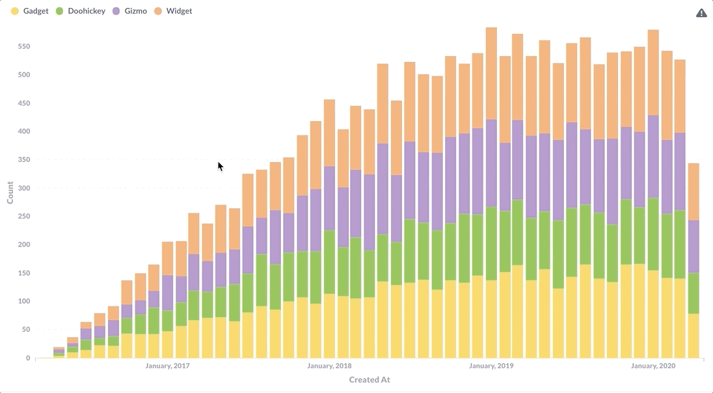
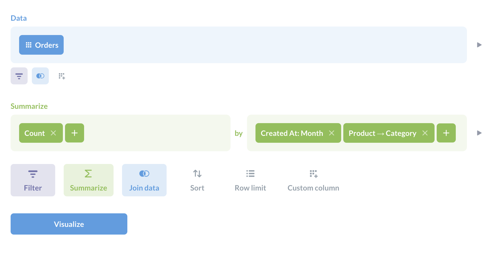
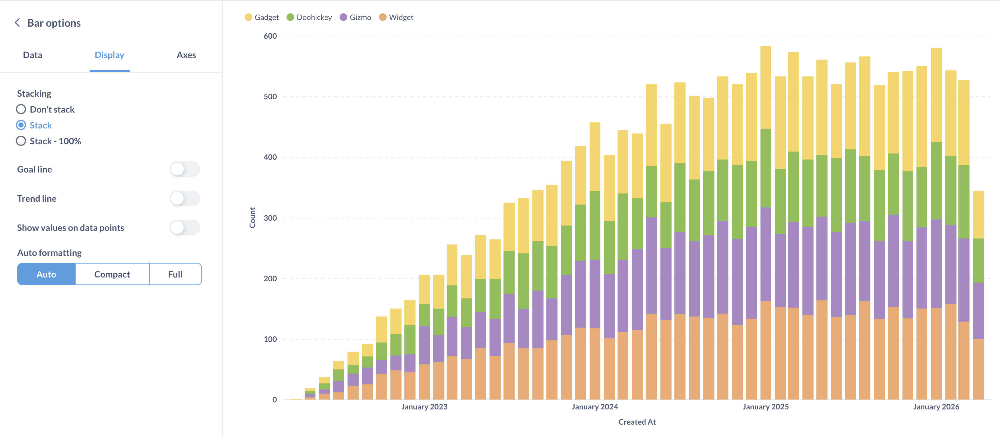
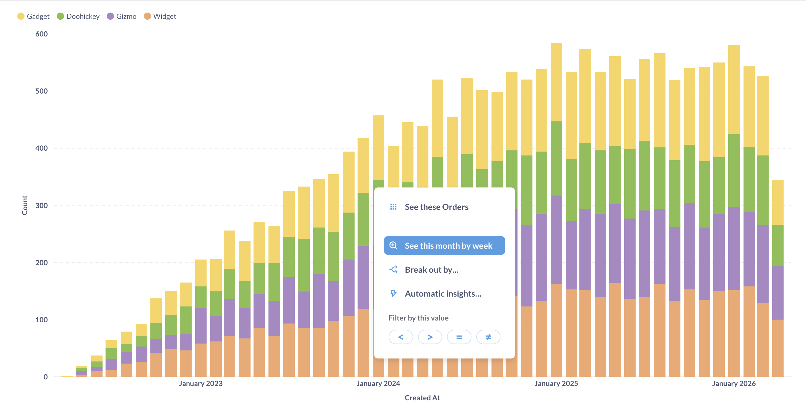
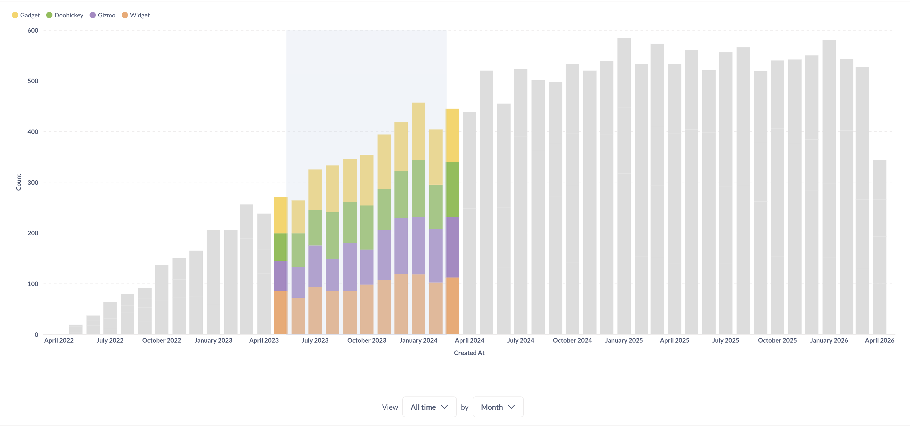
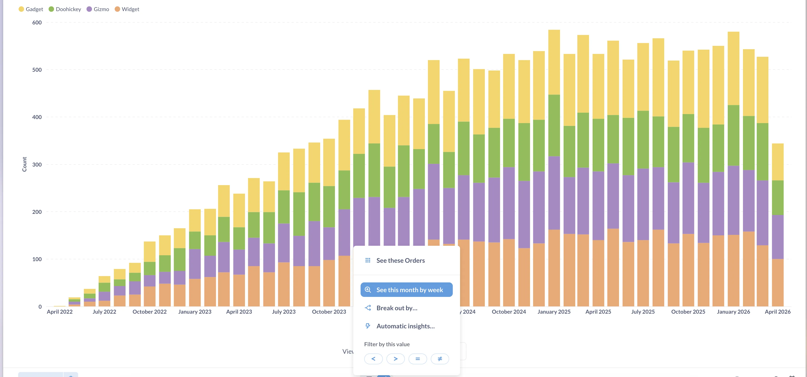
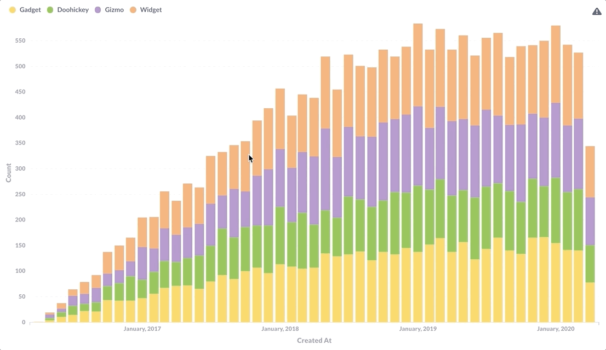
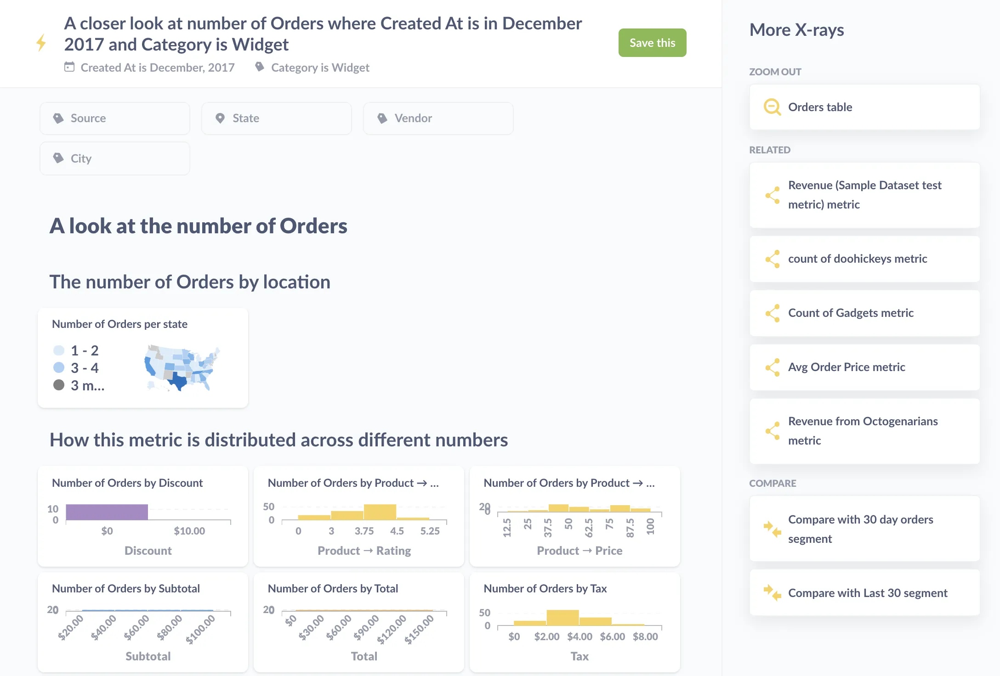

You can create charts that people can drill through in Metabase. Like this:

If you've only ever written questions in SQL, you may have missed the fact that Metabase could make your charts explorable. Or maybe you've clicked around on a dashboard and noticed that some charts have more drill-through options than others. We'll cover what are the different ways you can drill through those charts and how to set up drill-through on your charts (sometimes called drill-down).

## What is drill-through and how does it work?

Let's tour the drill-through functionality. Here's the question that we'll use for exploration:

The visualization has been set to a **stacked bar chart**.

Click anywhere on the chart to open the **Action Menu**. The **Action Menu** presents a few different drill-through options that you can choose from when exploring your data.

We'll step through each of the options in the popup menu you see above:

- [Zoom in on the data](#zoom-in)
- [View the records that compose that data](#view-these-records)
- [Break out the data](#breakouts)
- [X-ray the data](#x-rays)

### Zoom in

There are two ways to zoom in on orders, [Select-to-zoom](#select-to-zoom) and [Auto-zoom](#auto-zoom).

#### Select to zoom

You can click and drag to select an area of a chart to zoom in on.

#### Auto-zoom

You can left-click to bring up the **Drill-through Menu** > **See this month by week** and Metabase will create a close-up of the data surrounding the value you selected.

The **See this date** option will choose an appropriate range of values based on the full range of values in the chart.

### View these records

You can click on a value on a chart and select `View these orders` to bring up a table with the individual records that compose the value.

### Breakouts

**Breaking out** by a category lets us do things like see the banana cream pie orders in June 2017 broken out by the status of the customer (e.g., new or VIP, etc.) or other different aspects of the order. Different charts will have different breakout options, such as Location and Time.

## X-rays

[X-rays][x-rays] are automatically-generated explorations of your data. You can click anywhere on a chart to perform an X-ray, and Metabase will generate a dashboard full of different questions about the data. You'll have an option to save that X-ray as a dashboard, which you can then edit to your liking, by removing irrelevant questions, or adding new questions or [text boxes][markdown] to fill in the story you want to tell.

Clicking on a point or a bar additionally gives you the option to compare data, which will give you another dashboard with auto-generated charts.

If X-rays don't make sense for your data, you can [disable X-rays][x-rays-disable]. Learn more about [X-rays in our documentation][x-rays].

## How to create charts you can drill through

### Build charts using query builder

You get the [Action Menu](#what-is-drill-through-and-how-does-it-work) on charts automatically when you create a question using the [query builder](/docs/latest/questions/introduction). That's it. That's all you need to do.

### Convert SQL questions to models

If you write a question using SQL, you won't get full drill-through out of the box. For example, you won't be able to drill down to unaggregated records, or zoom in on a time period with smaller granularity than your original question. People won't be able to get more granular information than your SQL query provides.

But with careful query planning, you can enable people to drill down on your charts by building your SQL queries with the highest level of detail that makes sense for your problem, and then build models on top of them. For example, if you want people to drill down to unaggregated records, start with a query that doesn't aggregate records. Or if you want people to be able to change datetime granularity, truncate your dates the smallest granularity that makes sense (e.g. minute) and use the query builder to do the rest.

So the process is:

1. Write a question in SQL that brings together the starting data you need, like you're creating a view for people to query. So don't pre-filter or pre-summarize the data (aside from filtering out rows and columns you wish to exclude from the "view").
2. Save that question and turn it into a [model](/learn/metabase-basics/getting-started/models).
3. [Edit the model's metadata](/docs/latest/data-modeling/models) to specify each column's type. If Metabase knows which type of data each column contains, it can work its drill-through sorcery.

From there, you can either let people use the model as the starting point for people to ask questions with the query builder, or you can create query builder questions based on that model for people to play around with.

The other option for SQL-based questions is to...

### Add the question to a dashboard and set a custom destination

[Custom destinations](../dashboards/custom-destinations) aren't the same thing as providing people with the drill-through menu. That is, people won't be able to slice and dice the question's data if you add a custom destination.

But custom destinations _do_ give you more control over what happens when people click on a chart, and custom destinations are in some ways more powerful than the drill-through menu (despite what our inconsistent capitalization might imply). You can send people to another question, dashboard, or external URL, and you can even parameterize those destinations based on values in the chart.

Custom destinations work for both SQL and query builder questions, as custom destinations override the default click behavior. You can also set up [crossing-filtering](/learn/dashboards/cross-filtering) on a dashboard, so that people can click on a chart to update a filter.

[markdown]: /learn/metabase-basics/querying-and-dashboards/dashboards/markdown
[x-rays]: /docs/latest/exploration-and-organization/x-rays
[x-rays-disable]: /docs/latest/exploration-and-organization/x-rays#disabling-x-rays
