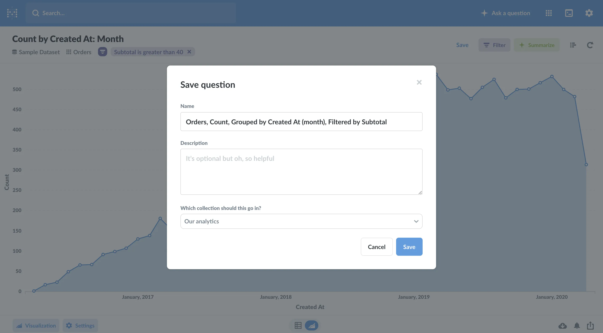
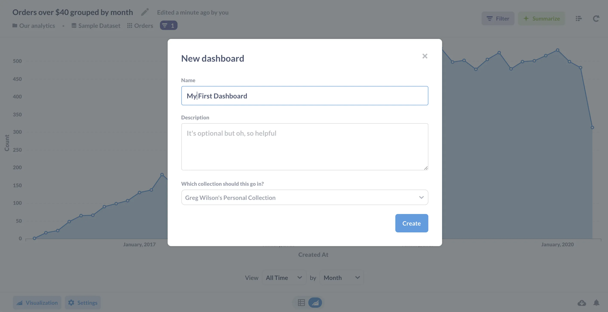
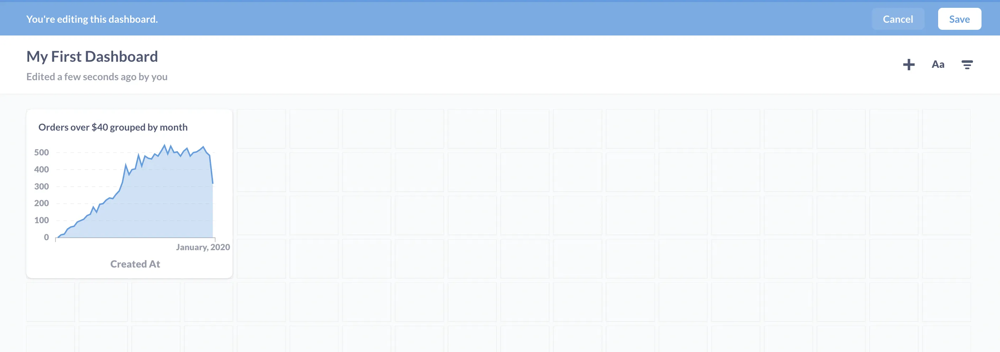
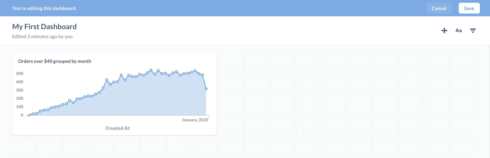
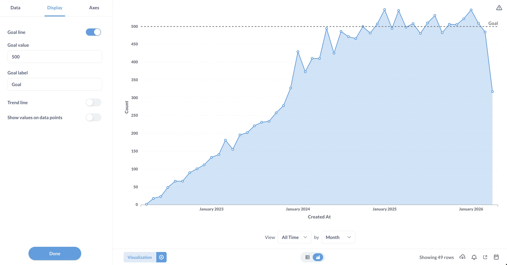
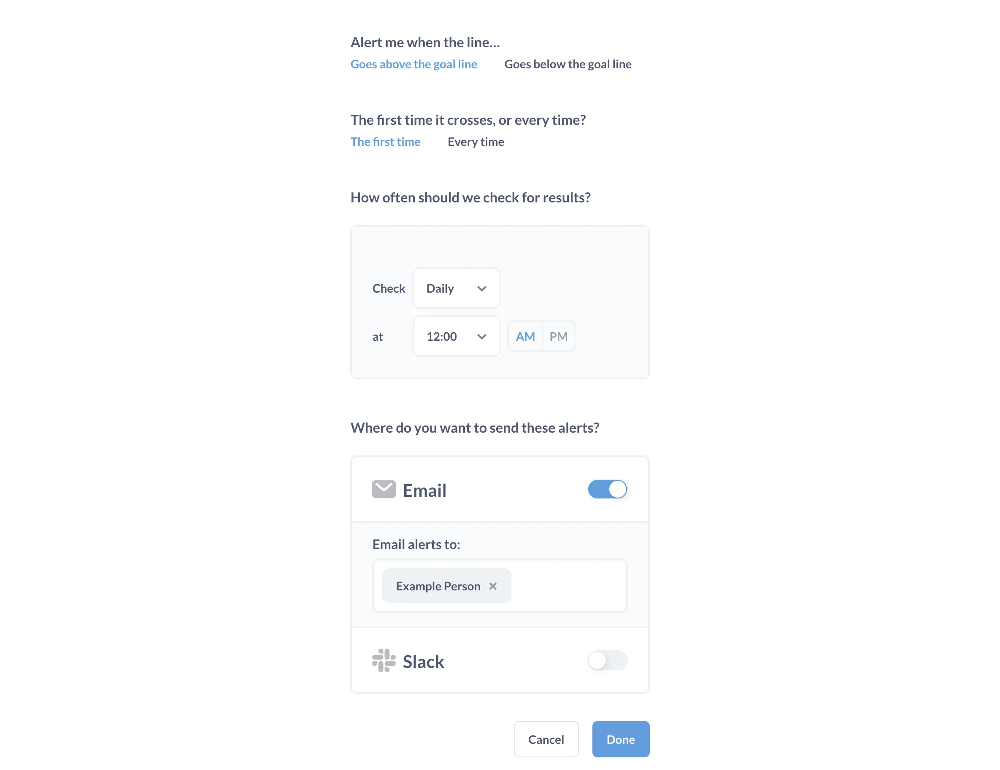

You can use Metabase all on your own, but it becomes even more useful when you start sharing your answers with other people on your team or in your organization. The first step is saving some of your questions.

## Saving questions

Sometimes you'll find yourself asking certain questions again and again, whether it's running regular reports, looking up something about an important segment of users, or just answering the same question for other people in your company. To keep from repeating the same set of steps each time you want to ask the same question, you can save your questions to use later.

To do this, click on the **Save** button in the top-right of the query builder.

Metabase will take a stab at giving your question a meaningful name, but you can (and should) use your own naming convention that'll help you and others find your questions later on. You can also pick which [collection](/docs/latest/administration-guide/06-collections) to save your question in. You can think of collections like folders, to which you can add [permissions](/learn/permissions/collection-permissions).

Save the question you created as "Orders over \$40 grouped by month". When you save a question, Metabase asks if you want to add the question to a new or existing dashboard. Let's say "yes" and then click on **Create new dashboard**. The dialog prompts you to create a new dashboard and give it a name and description. You can name it anything you want---we'll call ours `My First Dashboard`.

## Creating a dashboard

Dashboards are great when you have a set of answers that you want to view together. Your saved questions will be displayed as _cards_ on the dashboard, which you can resize and move around.

So, after you click the button to create your dashboard, you should see your chart as a little card.

You can move and resize your chart so you can get it looking just how you want it. We'll make ours a bit wider to let those data points breathe:

Don't forget to click **Save** at the top to save your work when you're done.

## Sharing answers directly

Once you have asked a question or saved a dashboard, the URL in your browser will link directly to that question or dashboard. That means you can copy and paste that URL into an email or chat and let other people see what you've found.

This will only work if Metabase is installed on a shared server, and will require creating Metabase accounts for the people you want to share with. However, if the people you're sharing questions with don't have permission to the [collection](/learn/permissions/collection-permissions) it's stored in — or if you've saved it to your **Personal Collection** — they won't be able to see what you're sharing.

## Set up an alert for your question

You can set up [alerts](/docs/latest/questions/alerts) on questions to have Metabase message you via email or Slack based on different criteria. But to create alerts, your administrator must first set up your Metabase with [email](/docs/latest/configuring-metabase/email), [Slack](/docs/latest/configuring-metabase/slack) or [webhooks](/docs/latest/configuring-metabase/webhooks).

Here's an example of how to set up a **Goal line alert**. When you set up a goal line alert on a question, Metabase will notify you when the results go above or below a goal line you define.

Let's say we want Metabase to email us the first time the number of orders over \$40 per month is over 500. For our area chart, let's first create a goal line. Click on the **gear** in the lower left, then on the **Display** tab. Toggle on the **Goal line** option, then enter the value "500" in the box below the toggle switch.

We'll save our changes. With our goal line in place, we can now set up our alert.

We'll click on the little **bell** icon in the lower right. Since we've set a goal line, Metabase automatically asks us if we want to be told when the answer to our question goes over or under our goal (we want "over") and whether we want Metabase to notify us the first time or every time (we'll choose the first time). We then tell Metabase to notify us by email and choose who should receive the message:

The next time we have a month with a lot of high-value sales, Metabase will send us the good news automatically.
