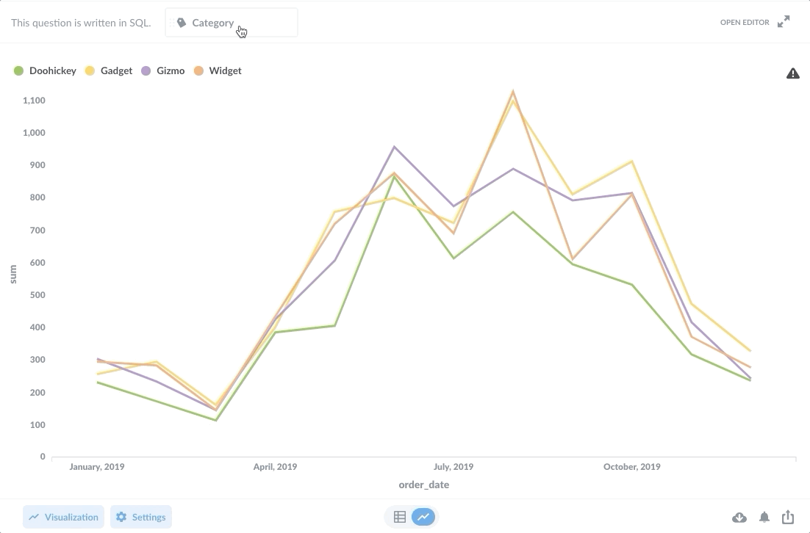
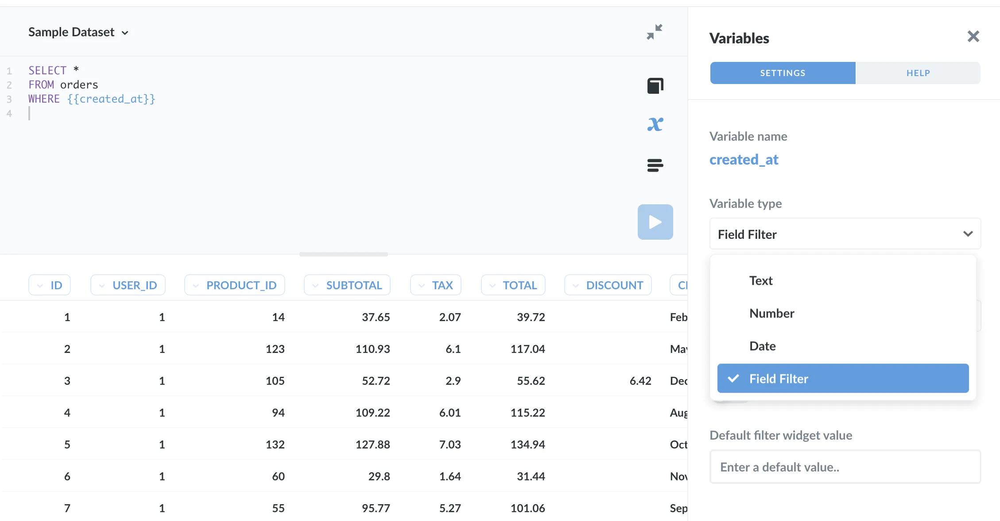
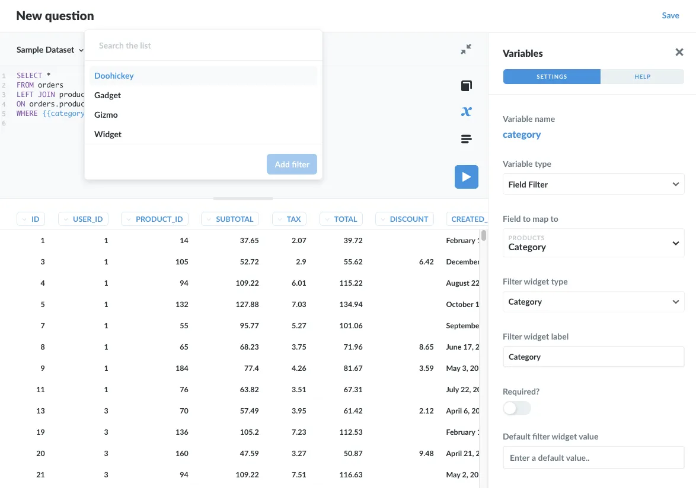
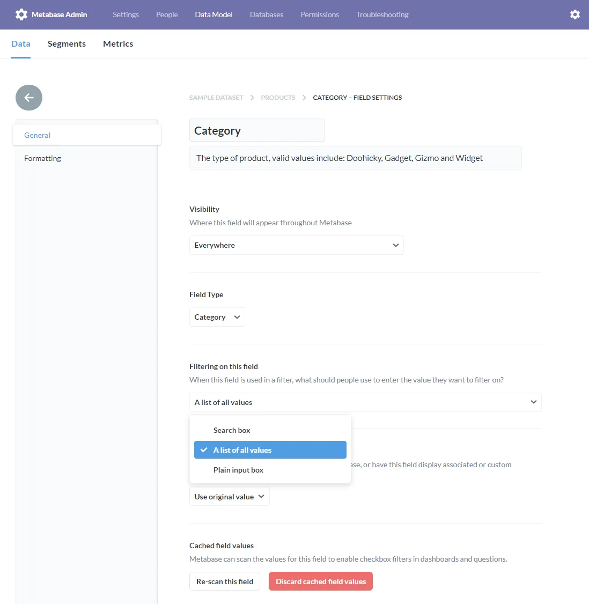
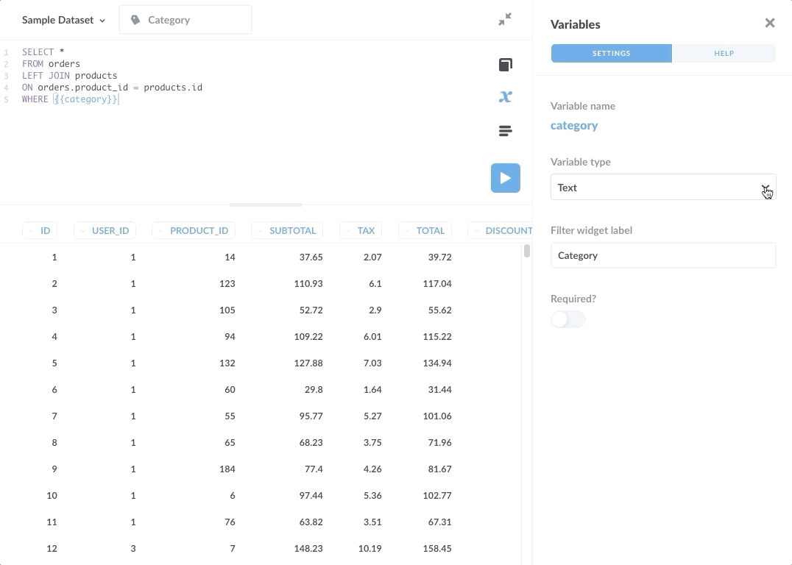
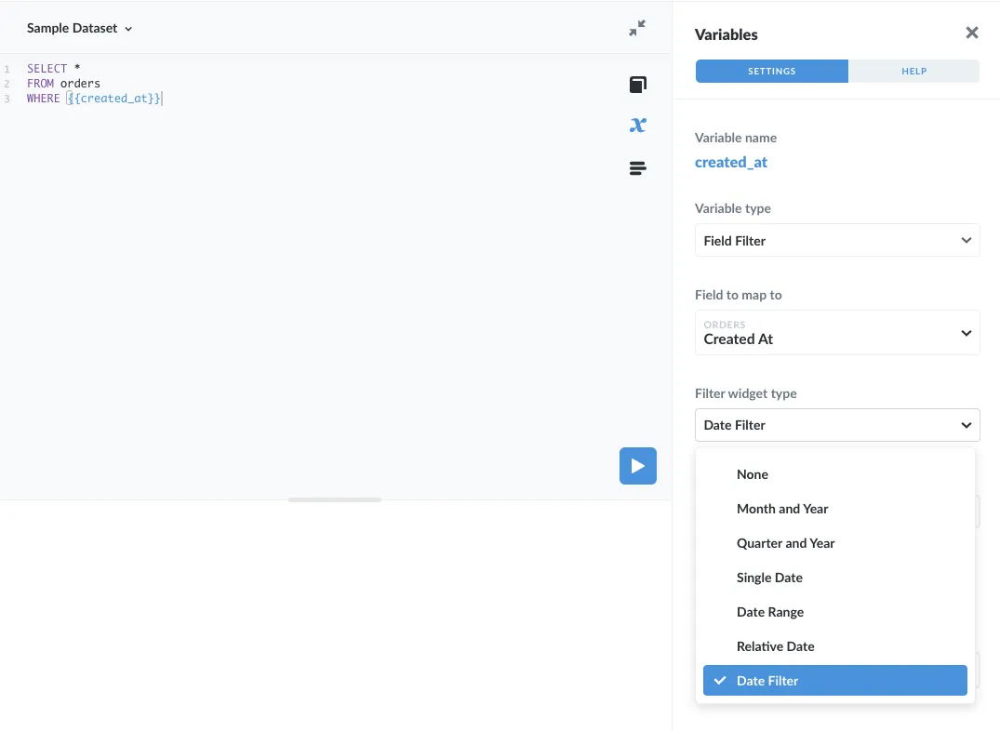
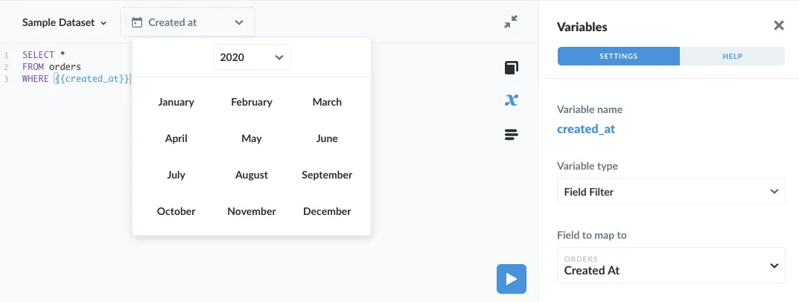
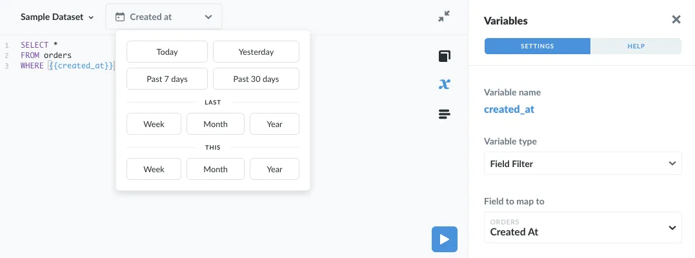
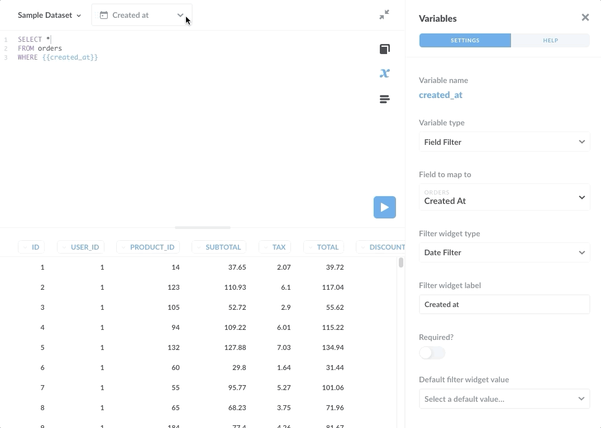
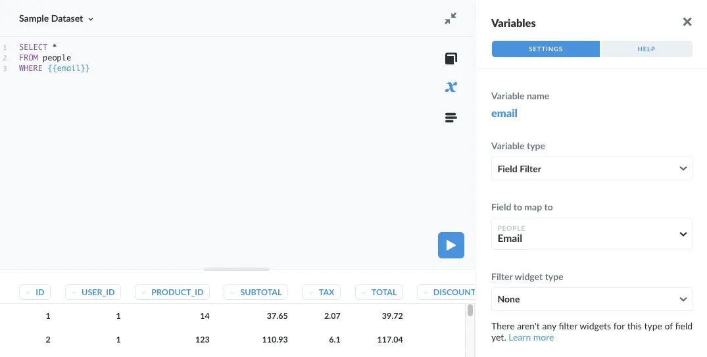



<div class="learn-toc" markdown="1">
</div>

This article shows how to add smart SQL filter widgets to your SQL queries in Metabase using a special type of variable called a **field filter**.

## Introduction to Field Filters



For Metabase questions written in SQL, we can use [basic variable types](/learn/sql-questions/sql-variables)---Text, Number, and Date---to create simple SQL filter widgets. To create "smarter" filter widgets that can display options specific to the data in the filtered columns, such as to create a dropdown menu of values, we can use a special variable type called a [Field Filter](/docs/latest/questions/native-editor/sql-parameters#the-field-filter-variable-type).



Field Filters can initially confuse some people, because [they only work with certain fields](/docs/latest/questions/native-editor/sql-parameters#field-filter-compatible-types), and people expect them to behave like basic input variables (which they don't). However, Field Filters are well worth learning, as you can use them to create much more sophisticated filter widgets. This article will go through Field Filters in depth, but first let's discuss the main differences between Field Filter variables and basic Text, Number, and Date variables.

## Distinguishing Field Filters from simple Text, Number, and Date variables

1. _Field Filters are optional by default._ If no value is given, the SQL query will run as if the Field Filter didn't exist. You do, however, have the option to require a value.
2. _Field Filters won't work with table aliases._ Since Field Filters rely on metadata about columns in your tables (and the specific names of those tables), the filters can't "know" that you've aliased a table. And depending on the database you're using, you may need to include the full schema path in the `FROM` clause.
3. _Field Filters use a special syntax so they can handle SQL code behind the scenes._ You simply supply a Field Filter to a `WHERE` clause (without a column or operator) and the Field Filter will manage the SQL code for you. This allows the code to account for multiple selections people make in the filter widget.

Point #3 can be especially confusing, so let's unpack it with an example.

## Creating a SQL filter widget with a dropdown menu

We'll use the [Sample Database](/glossary/sample_database) included with Metabase to add a filter widget with a dropdown menu to a question written in SQL. Let's say we want to create a SQL question that grabs all the orders from the `Orders` table, but we want to give people the option to filter the results by category in the `Products` table. We _could_ create a `Products.category` filter with a basic input variable, like so:

```sql
SELECT *
FROM Orders
LEFT JOIN Products
ON Orders.product_id = Products.id
[[WHERE Products.category = {{category}}]];
```

In this case, we enclose the `WHERE` clause in double brackets to make the input optional, and use the **Variables sidebar** to set the variable type to `Text` and the filter widget label to `Category`. This approach works, but it's not ideal:

- In order to filter the data, people would have to know which categories exist (and spell them correctly when they input them).
- Plus, they can't select multiple categories at a time, as the `{{category}}` variable only accepts a single value.

By contrast, a Field Filter will map the variable to the actual column data. The filter widget connected to the variable then "knows" which categories are available, and can present a dropdown menu of those categories, like so:



A word on the widget: the dropdown menu is just one of the options available. In the case of fields of type `Category`, like our `category` field in the `Products` table, we could also set the filter widget as a search box or a plain input box. Admins can configure field settings in the **Data Model tab** of the **Admin Panel**.



Note that Metabase will automatically use a search box if the number of distinct values in the column is greater than 300, even if you select the dropdown option. Learn more about [editing metadata](/docs/latest/administration-guide/03-metadata-editing) in our documentation.

Now, let's get back to our question. Here's the syntax for the `Products.category` Field Filter. Note the omission of the column and operator before the variable in the `WHERE` clause---we'll talk more about Field Filter syntax below:

```sql
SELECT *
FROM orders
LEFT JOIN products
ON orders.product_id = products.id
WHERE {{category}};
```

With our variable in place in the `WHERE` clause, we can use the **Variables sidebar** to wire up our variable as a Field Filter. We'll set:

- `Variable type` to `Field Filter`.
- `Field to map to` to `Products → Category`. This setting tells Metabase to connect the variable in our SQL code to the `category` column of the `Products` table.
- `Field widget type` to `category`.
- `Field widget label` to `category`.



We won't require the variable, so no default value is necessary. If the query runs without a specified value in the filter widget, the query will return records from all categories.

Note that the `WHERE` clause does not specify which column the variable should be equal to. This implicit syntax (the hidden SQL code) allows the Field Filter to handle the SQL code behind the scenes to accommodate multiple selections.

## Creating sophisticated SQL filter widgets for date fields

We can create a basic input variable of type Date, which will add a SQL filter widget with a simple date filter. If, instead, we use a Field Filter variable, we can connect that variable to a field (column) that contains dates, which unlocks a lot more options for configuring our filter widget. Here's the SQL:

```sql
SELECT *
FROM ORDERS
WHERE {{created_at}}
```



Here are the different widget types for Field Filters mapped to Date fields:

- Month and Year
- Quarter and Year
- Single Date
- Date Range
- Relative Date
- Date Filter

Each widget type offers different ways for people to filter the results. Here are three SQL field filter examples:







The Date Filter widget type offers the most flexibility, allowing people to filter by relative dates and ranges.

## Field Filter gotchas

There are a few places that people typically get stuck when trying to implement Field Filters.

### Field Filters are incompatible with aliasing

As noted above, Field Filters won't work if you use aliases in your SQL query. For example, this code (with aliases) will not work:

```sql
-- DON'T DO THIS
SELECT *
FROM orders AS o
LEFT JOIN products AS p
ON o.product_id = p.id
WHERE {{category}};
```

Whereas this code without aliases _will_ work:

```sql
SELECT *
FROM orders
LEFT JOIN products
ON orders.product_id = products.id
WHERE {{category}};
```

The reason is that Field Filters work by analyzing metadata about your data (e.g., the column names of your tables), and that metadata does not include the aliases you create in your SQL code. Note that some databases require the schema in the `FROM` clause. An example for Oracle would be `FROM "schema"."table"`. In BigQuery, back ticks are needed: `` FROM `dataset_name.table` ``.

### Omit the direct assignment in the WHERE clause

As stated above, the SQL code around Field Filters is not exactly street legal. You may be tempted to write:

```sql
-- DON'T DO THIS
WHERE category = {{ category }}
```

because that is the correct syntax for a `WHERE` clause in standard SQL. But that syntax won't work for Field Filters. The correct syntax for Field Filters omits the `=` operator:

```sql
WHERE {{ category }}
```

The reason for this shorthand is so that Metabase can, behind the scenes, insert the SQL code for situations like multiple selections, e.g., when a user selects multiple categories from a dropdown.

### Only certain fields are compatible with Field Filters

Here is the [list of compatible fields](/docs/latest/questions/native-editor/sql-parameters#field-filter-compatible-types).



You can find a list of incompatible field types in our [documentation on Field Filters](/docs/latest/questions/native-editor/sql-parameters#the-field-filter-variable-type).

## Learn more about SQL filters and variables

Check out our guide to [basic SQL input variables - Text, Number, and Date](/learn/sql-questions/sql-variables).

You can also read our documentation on:

- [Basic input variables](/docs/latest/questions/native-editor/sql-parameters#defining-variables)
- [Field Filters](/docs/latest/questions/native-editor/sql-parameters#the-field-filter-variable-type)
