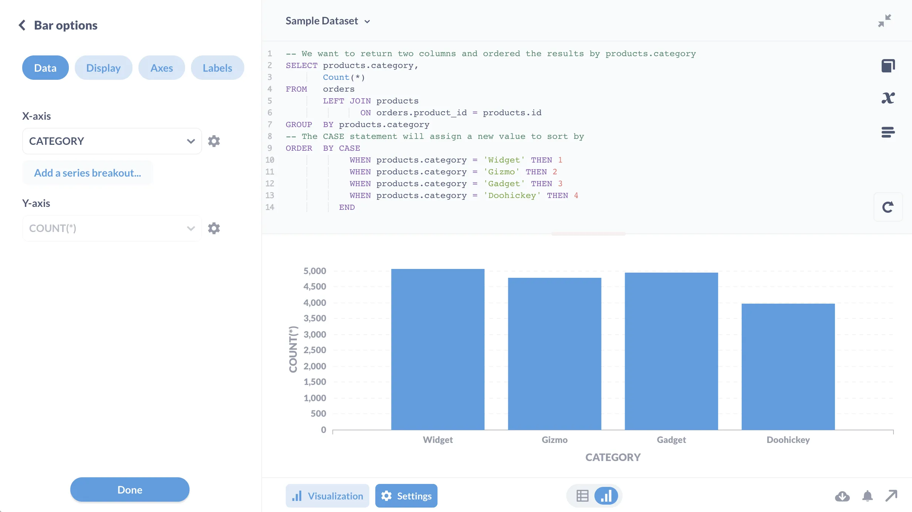

Here's the problem: you're writing a query, and you want to keep the results sorted on a bar or funnel chart, but the values the query returns screw up the ordering.

For example, let's say you want to order something that doesn't sort very well, like if you had four different steps labeled "First", "Second", "Third", "Fourth" and wanted to sort those in their semantic order, regardless of whatever their corresponding values are. Metabase (or whatever tool you're using) would sort those values as strings (i.e., they would get sorted alphabetically, not semantically, which wouldn't make much sense: "First", "Fourth", "Second", "Third").

Here's a trick for rearranging the chart to specify the order you want.

1. Write your query however you're going to write it (following [best practices][best-practices], of course).
2. Assuming you want to order by the values in a column called `step`, at the end of the query, use a `CASE` expression to define the order for the values in the `step` column.

```sql
ORDER BY
    CASE
        WHEN step = 'First' THEN 1
        WHEN step = 'Second' THEN 2
        WHEN step = 'Third' THEN 3
        WHEN step = 'Fourth' THEN  4
    END
```

## Example of sorting using a CASE expression



Here's an example that uses the Sample Database included with Metabase that you can try out for yourself. Let's say we want to see the number of orders per product category, but we need to sort them like so: Widget, Gizmo, Gadget, Doohickey. Here's the code with the case statement:

```sql
-- We want to return two columns, ordered by products.category
SELECT products.category,
       Count(*)
FROM   orders
       LEFT JOIN products
              ON orders.product_id = products.id
GROUP  BY products.category
-- The CASE statement will assign a new value to sort by
ORDER  BY CASE
            WHEN products.category = 'Widget' THEN 1
            WHEN products.category = 'Gizmo' THEN 2
            WHEN products.category = 'Gadget' THEN 3
            WHEN products.category = 'Doohickey' THEN 4
          END
```

This trick is especially useful with [funnel charts][funnel] when you need to preserve the sequence.

[best-practices]: /learn/grow-your-data-skills/learn-sql/working-with-sql/sql-best-practices
[funnel]: /learn/visualization/funnel
