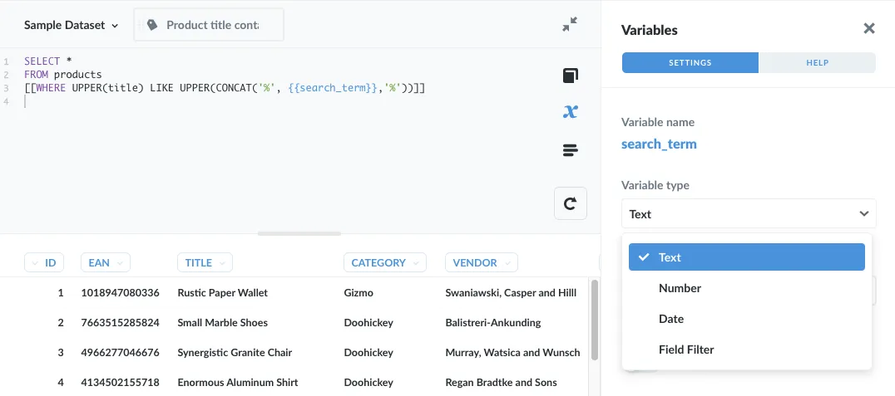
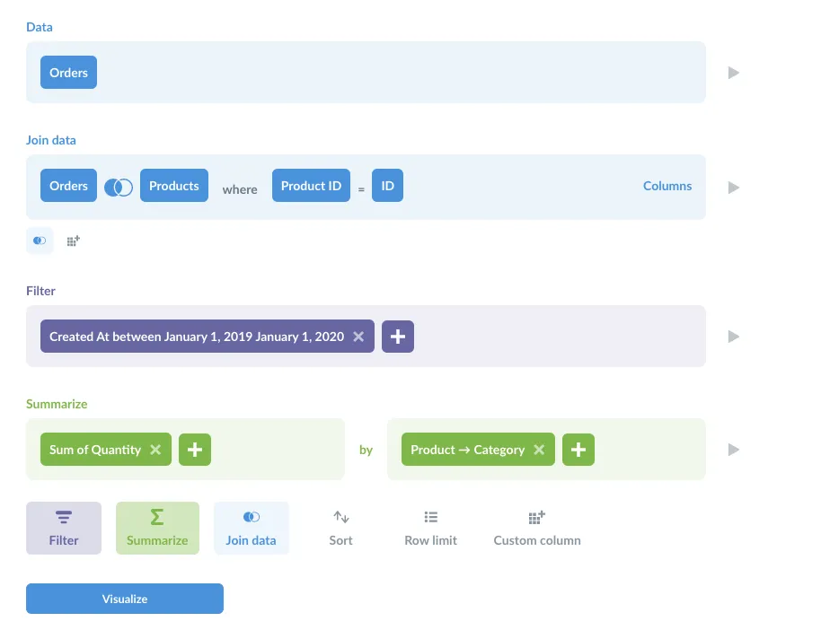
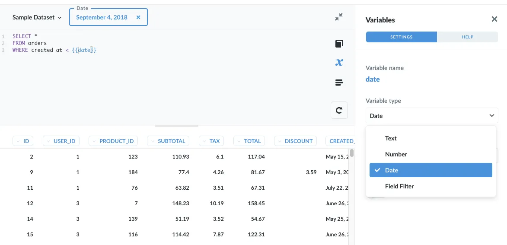
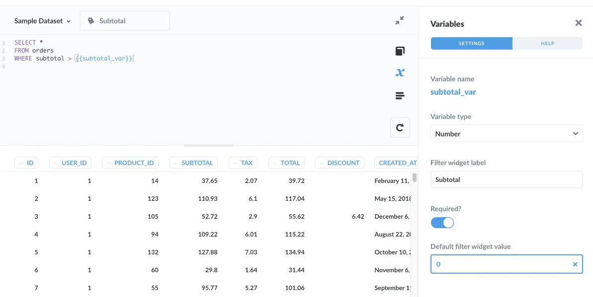
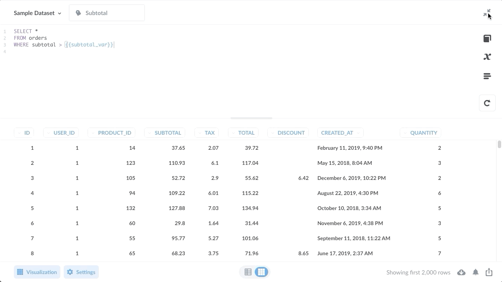
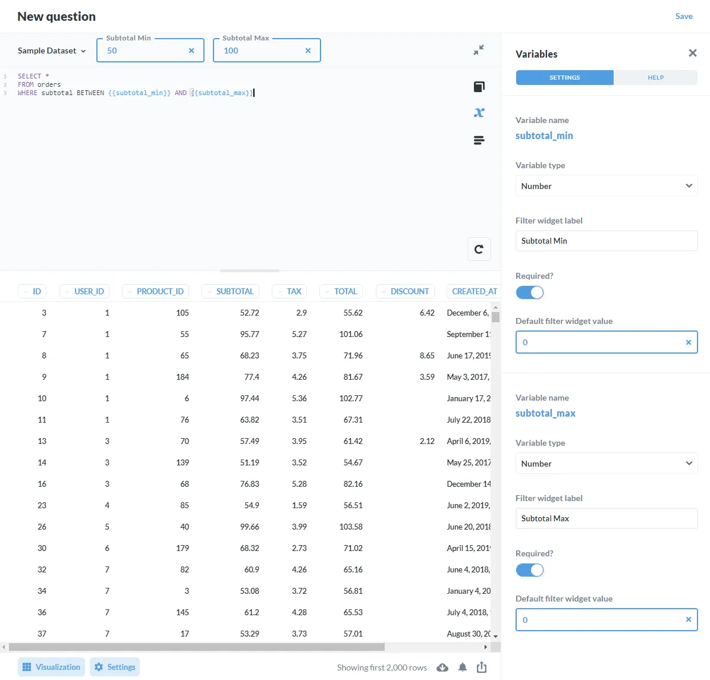
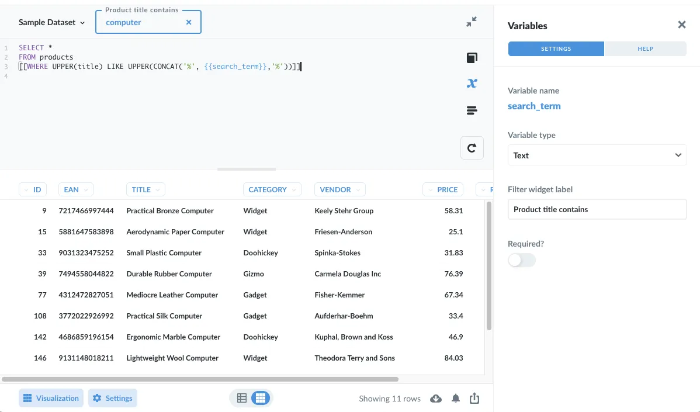
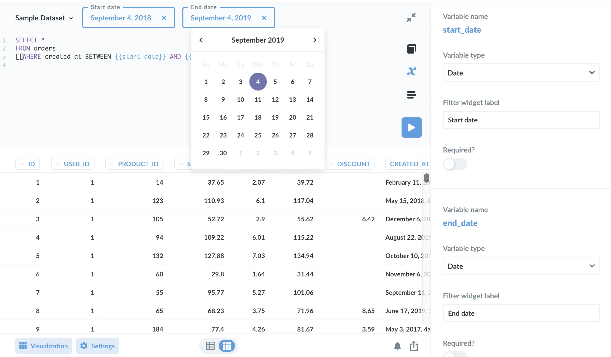



This article walks through how to create questions in Metabase using native SQL queries so that viewers of our questions can plug in values and filter the results. While Metabase makes it easy to summarize and visualize data without SQL, data analysts sometimes need to dig into complicated queries, which they can write using Metabase's [SQL editor](/docs/latest/questions/native-editor/writing-sql).

## Introduction to SQL variables and filter widgets

For example, using the [Sample Database](/glossary/sample_database) included with Metabase, we might write a question in SQL that pulls product information about our orders, but we want viewers of that question to specify the category of products that they want to view. To give people the option to input values on saved SQL questions, we can write SQL queries with variables, and Metabase will automatically create filter widgets that people can use to enter values.



For now, we'll just be focusing on filters applied to questions written in SQL. For filters on dashboards, check out [Adding filters to dashboards with SQL questions](/learn/dashboards/filters).

But first: do you want to write your question using SQL, or would query builder better suit your use case?

## SQL questions versus query builder questions

Before we dig into adding filter widgets, it's worth considering how people will use our question. If we just want to give people the option to plug in values to simple filter widgets on dashboards, writing a question in the **Query Builder** and adding variables to our SQL code makes sense.

If, instead, we compose a question using the **Query Builder**, filter widgets are unnecessary, as viewers of our question will have the full suite of query building primitives available to slice and dice the data however they like by [joining](/docs/latest/questions/query-builder/join), [filtering](/docs/latest/questions/query-builder/filters), and [summarizing](/docs/latest/questions/query-builder/summarizing-and-grouping) the data. For more sophisticated questions, they'll also have [custom expressions](/docs/latest/questions/query-builder/expressions) at their disposal, as well as have the ability to [drill-through the data](/learn/metabase-basics/querying-and-dashboards/questions/drill-through) to zoom in on orders, or click on values to view individual records -- functionality that does not apply to questions written in SQL.



If you can answer your question using the functionality in the query builder, we recommend you use those. If, however, you need custom SQL commands or functions, and you want your users to be able to filter the results of those questions, read on.

## The different types of variables available for native SQL queries



For questions composed using Metabase's [native SQL query editor](/docs/latest/questions/native-editor/writing-sql), there are four types of variables you can select:

- Text
- Number
- Date
- Field filter

One of these types, **field filters**, is unlike the others. In fact, it's better to think of the variable types falling into two main categories: basic input variables and field filters.

- _Basic input variables_ create simple filter widgets where people can plug in values to filter the question's results. Basic input variables comprise:

  - [Number](#basic-input-variable-number)
  - [Text](#basic-input-variable-text)
  - [Date](#basic-input-variable-date)

- _Field filter variables_ are special input variables. They are more sophisticated than basic input variables, and they behave differently. Field filters are "wired up" to columns, and can provide dropdown menus for people to select one or more values.

We'll cover the three basic input variables---Text, Number, and Date---below, and field filters in [another article](/learn/sql-questions/field-filters). But first let's get a sense of when to reach for one type of variable over the other.

## Field filters or basic input variables?

### When to use basic input variables

- For simple text, number, and date filtering. For more flexible date filtering, use a field filter.
- In general, for innumerable values that would not make sense to include in a dropdown (which would require a field filter).
- For cases where you may need to do some data wrangling/munging on the input variable in your SQL.

### When to use field filters

- To provide a dropdown menu for people to select from defined values. See the [list](/docs/latest/questions/native-editor/sql-parameters#field-filter-compatible-types) of available field types.
- To give multiple ways to filter by date.
- To hook up a variable to a filter widget on a dashboard.

## Basic input variables

Basic input variables take input like text, number, or dates. Basic input variables are good for when values are not predefined, or range widely, like order subtotals. Dates are a special case: Metabase provides widgets that allow people to select dates and times rather than typing values in.

### Basic input variable: Number

Let's use a basic input variable of type Number. Say we want to create a question that returns all of the records from the `Orders` table, but we want to give people the option to filter out orders based on the order `subtotal`.

Let's keep it simple and just give people the option to input a number so that the question will return records for orders with a subtotal _greater than_ that number.

To include a variable in your query, simply wrap the variable name in double braces, like this: `{{ variable }}`. In this example, we'll call our variable, `{{subtotal_var}} `. Here's the SQL:

```sql
SELECT *
FROM orders
WHERE subtotal > {{subtotal_var}}
```

When we add a variable to a SQL query, Metabase will add a filter widget at the top of the question, and slide out a sidebar to present options for the variable.



Here are the options in the **Variables sidebar**:

- _Variable type:_ Types can be `Text`, `Number`, `Date`, or `Field filter`. The variable type determines the input interface for variable's widget (e.g., for `Date`, the widget will present a date picker).
- _Filter widget label:_ The name of your variable as presented in the widget, which defaults to the variable name in the SQL query.
- _Required?_ When you make a variable required, Metabase will prompt you for a default filter widget value to plug into the variable when the question first loads. If you _don't_ provide a default, Metabase won't execute the query until a value is supplied.

In the case of `subtotal_var`, we want to:

- Set the `Variable type` to be `Number` (since we're dealing with subtotals).
- Change the `Filter widget label` from `subtotal_var` to `Subtotal` (just to make it easier to read).
- Toggle `Required?` to be true.
- Set the `Default filter widget value` to `0`. That way, when a question runs, it will return all results automatically; people can enter a higher subtotal if they wish to filter the results.

Now we're ready to plug in values into our Subtotal widget, and filter for orders with Subtotals greater than that value:



### Making a basic input variable optional

If we want to make the filter widget optional, we can enclose the `WHERE` clause in double brackets:

```sql
SELECT *
FROM orders
[[WHERE subtotal > {{subtotal_var}}]]
```

With the `WHERE` clause in brackets, if the viewer does not enter a subtotal, and no default is set, the query would simply return all records from the `Orders` table (i.e., Metabase would only run `SELECT * FROM orders`).

### Adding multiple filters

We can use multiple filters as well. If, for example, we'd prefer people filter the results by inputting a range of subtotal values, we can add two variables for lower and upper bounds:

```sql
SELECT *
FROM orders
WHERE subtotal BETWEEN {{subtotal_min}} AND {{subtotal_max}}
```

In this case, two widgets will appear, one for each variable.



### Basic input variable: Text

Let's try an example using a simple text input variable. In this case, we want to create a question with a filter widget that allows people to search for product titles that contain the text they enter into the widget.

Here's the code:

```sql
SELECT *
FROM products
[[WHERE UPPER(title) LIKE UPPER(CONCAT('%', {{search_term}},'%'))]]
```

We enclose the `WHERE` clause in brackets to make the widget input optional. We bookend the variable with the wildcard character `%` to indicate that the term could have zero or more characters to the left or right of the variable. Additionally, we guard against case sensitivity by using the `UPPER` function on both the `title` column and the `{{search_term}}`.

And here's our filter:



### Basic input variable: Date

When you select the Date variable type, the filter widget will present a simple date picker. Here's a question with two basic date variables so that users can input a start and end date to return orders placed between those dates.

```sql
SELECT *
FROM orders
[[WHERE created_at BETWEEN {{start_date}} AND {{end_date}}]]
```



Note that people need to select dates for _both_ widgets in order for the filter to activate, which can lead to unexpected behavior. For example, someone might leave the end date blank and expect the orders to be filtered from the start date up to today, when in fact no filter would be applied.

For dates, consider instead using a [field filter](/learn/sql-questions/field-filters), which offers a lot more flexibility.
