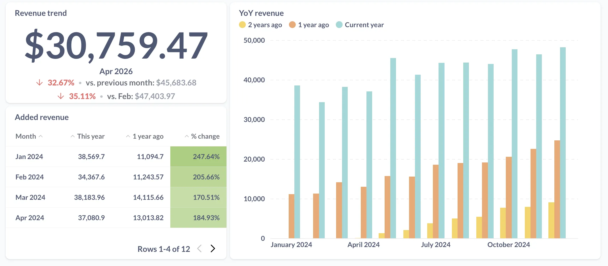
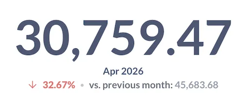
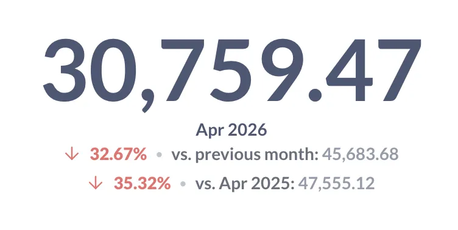
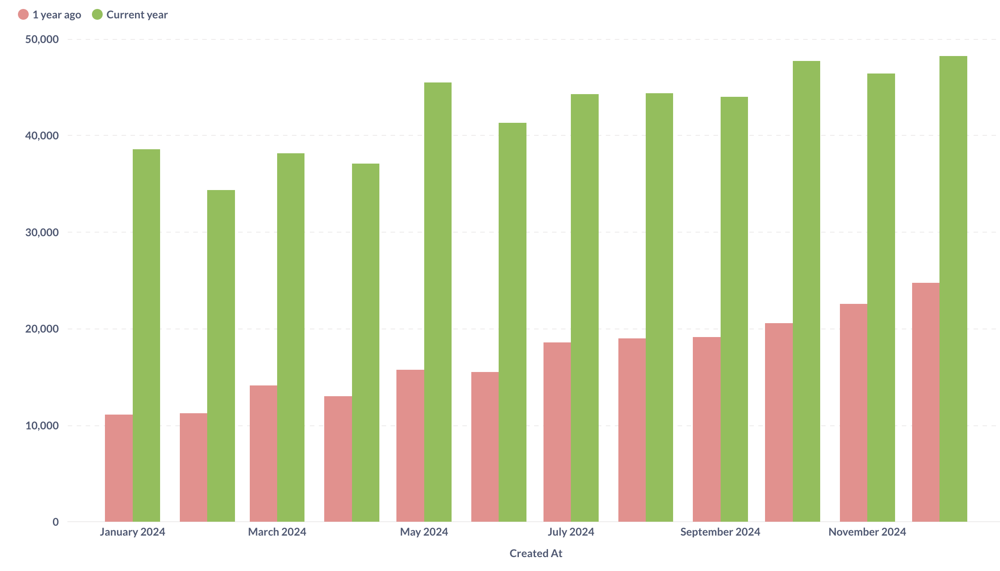
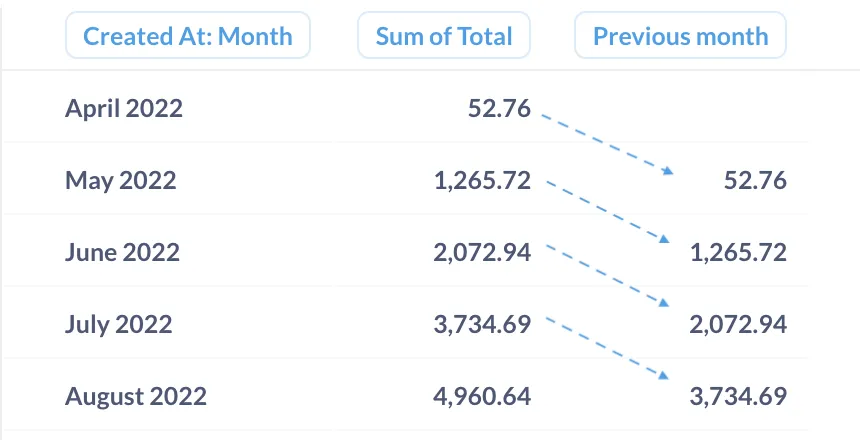
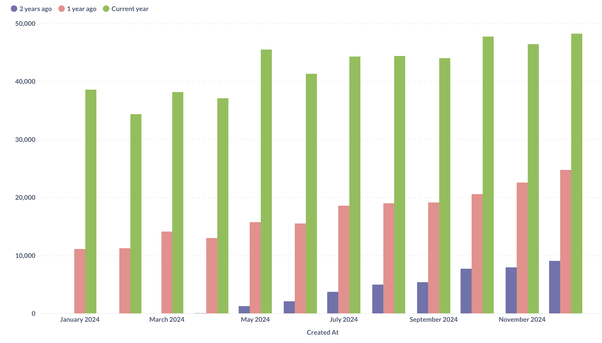
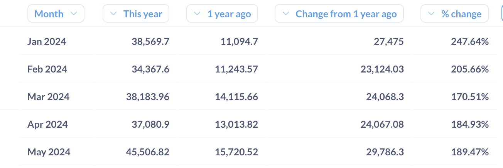

> This tutorial uses the [Offset function](/docs/latest/questions/query-builder/expressions/offset), which is currently unavailable for MySQL/MariaDB.



## Introduction

This tutorial will show you how to compare data over two or more time periods. Here are the charts we're going to make:



We'll give you step by step instructions that you can follow along in your Metabase.

## Setup

We’ll work with the Orders table from the Sample Database that comes with every fresh Metabase instance.

We'll use a question that computes the revenue – sum of order totals – by month.

To create the question:

1. Start a New question from the `Orders` table;
2. Add a summary: `Sum of...` the `Total` column, grouped by `Created At: Month`;
3. Save the question.

## Comparing the latest period using a trend chart

If you just want to track performance of a metric in the _latest_ time period vs the previous one (or a few previous periods), the trend chart is the way to go. A trend chart looks like this:



To build this chart, starting from the “Revenue by month” question you created in [the setup section](#setup):

1. If you are in the query builder, **click “Visualize” to create a chart**.

   Metabase will create a time series chart by default because the breakout variable is a date. Let’s change the visualization to a _trend chart_.

2. **Change the visualization to Trend:**

   - Click on the **Visualization** button in the bottom left of the screen;
   - Pick “Trend”.

   Metabase will show the latest value in the data, and how the value compares to the same metric in previous period. You can also choose to compare to static values (like to a goal you've set), or to several periods.

3. **Add another comparison to the value 12 months ago**
   - From the trend chart, open the visualization settings by clicking on the gear icon in the bottom left;
   - In the **Data** tab, click **Add comparison**;
   - Pick **12 months ago**.

Your trend chart will now contain two comparisons: one comparison with the previous month, and one with the same month a year ago.



> 💡 **Tip**: Check out other trend visualization settings in the Display tab. For example, you could add a \$ sign to the display of revenue, or change the colors used for comparison.

## Year-over-year comparison

Often you want to look not just at the latest month, but at performance in _all months_ this year, and how they compare to _all months_ last year. Rather than make 12 trend charts, we’re going to collect this information in a bar chart like this:



### Using the Offset function to get previous periods

We'll use a handy custom expression function [Offset](/docs/master/questions/query-builder/expressions/offset) that returns a value in a different row, specified by offset (for example, 1 row after or 5 rows before). If you've never used custom expressions before, you can check out our tutorial [Custom expressions in the notebook editor](/learn/metabase-basics/querying-and-dashboards/questions/custom-expressions).

We'll again start with the "Total order revenue per month" question from our [Setup](#setup).

First, we'll replicate what the trend chart did — compare the month's result to the previous month — but for _all_ months in the data rather than just the last one.

1. In the query builder, **add a new Offset expression in the Summarize section**:

   ```mbql
   Offset( Sum([Total]), -1)
   ```

   You can name the column something like `"Previous month"` (your data should still be grouped by `Created At: Month`).

   For every month, this expression will return the sum of total from the previous (_offset_ by -1) month.

2. **Preview the data** by clicking on the play button to the right of the Summarize block.

   You should see three columns: the month, the sum of total for that month, and the sum of total from the previous month.

   

   With `Offset`, you can easily compare monthly performance for each month to the previous month by looking at a single row.

### Visualizing YoY data as a bar chart

If we want to compare the data each month to the _same month in the previous year_, we can use the `Offset` function to return data from 12 month ago by specifying -12 offset. We can also present the data as a bar chart instead of a table for easier visual comparison.

From the question in the previous section, or from the [Setup question](#setup):

1. In the query builder, **add a new Offset custom expression** (or change the existing one) in the Summarize section :

   ```mbql
   Offset( Sum([Total]), -12)
   ```

   You can name the new column `"1 year ago"`. If you're editing the column from the previous section, remember to rename the column to reflect the new time period!

   For every month, this expression will return the sum of total from the current month offset by 12 months – so, from the month a year ago.

2. **Add a filter for the current year after the Summarize block**.

   Your results include all the data from the beginning of time. In a YoY chart, we want to see only the months of the current year and how they compare to the same months in the previous year, so we'll need to filter the data.

   - Add a filter for `Created At` after the Summarize block
   - Use **Relative dates** filter option and pick **Current > Year** .

   It's important to add the filter _after_ summarizing the data, not before. If you add a filter for the current year before computing the sum, the data for the last year won't be in the result, so you won't be able to offset it.

3. **Preview the data**.

   Now you should see just the months from the current year.

4. **Visualize the result as a stacked bar chart.**

   You might need to change the type of visualization: click on "Visualize" button at the bottom left of the screen, and select "bar chart".

5. **Turn off split y-axis to compare data on the same scale**

   Depending on your data, Metabase might create a split Y-axes for the bar chart. Because we want to compare the yearly results on the same scale, our chart should have only a single y-axis.

   While viewing the visualization:

   - Click on the "gear" icon at the bottom left of the screen
   - Switch to the Axes tab
   - Toggle **off** "Split y-axis when necessary"

6. **Change the order of bars** so that the previous year bar is to the left of the current year.

   Metabase will order the bars in a stacked bar chart using the order of expressions in the Summarize block, so the bar for the previous year will be to the right of the bars for the current year. Let's arrange the bars in chronological order instead.

   While viewing the visualization:

   - Click on the "gear" icon at the bottom left of the screen
   - In the Data tab, drag the rows for the series to arrange them in the correct order.

Your chart should look something like this:


### Add a comparison to 2 years ago

Now try it out yourself: follow the same steps to add another comparison to the data **2 years ago** from the current year.

<details markdown=1><summary markdown="span">Click here for a hint</summary>

1. **Add a new Offset expression**, with offset by 24 months :

   ```mbql
   Offset( Sum([Total]), -24)
   ```

   You can name it something like "2 years ago".

2. **Reorder** expressions in the Summarize block by dragging them (or reorder the bars on the bar chart).

   Since Metabase uses the order of expressions in the Summarize block for the order of bars on the chart, when you add a new 2-year offset, Metabase will include that offset column at the end. To position the 2-year offset before the 1-year offset, you'll need to either reorder the bars in the visualization (like we've done before), or reorder the expressions themselves by dragging them around in the Summarize block in the editor.

3. **Visualize** the chart.

</details>

Your chart should look something like this:



## Measuring difference and change

You can use the `Offset` function with some math to compute the change from one period to another – in value or in percentage, to get data like this:



Assuming you have already built a YoY chart using the instructions in the previous section:

1. In the query builder, **add a new summary for the YoY change in revenue**:

   ```mbql
   Sum([Total]) - Offset(Sum([Total]), -12)
   ```

   For each month, this expression will compute the revenue for that month in `Sum([Total])`, and then subtract the revenue from the previous month in `Offset(Sum([Total]), -12)`.

   You can preview the data to see the result.

2. **Add a new summary for change in revenue as a percentage**:

   To compute the percentage that the YoY change makes of the previous year's value, add the custom expression:

   ```mbql
   ( Sum([Total]) - Offset(Sum([Total]), -12) ) / Offset(Sum([Total]), -12)
   ```

   Here we're dividing the difference between current and previous years values by the previous year value.

3. **Visualize results as a table**.

   If you started from the YoY bar chart, change the visualization type to a table: click on the "Visualization" button at the bottom left of the screen and pick "Table".

4. **Format the percentage change column as percent**.

   By default, Metabase will display the column as a decimal, but you can change the column formatting to display it as a percentage:

   - Click on the column header to open the column action menu
   - Click on the gear icon to open column format settings
   - Select **Style > Percentage**

> 💡 **Tip**: You can use _conditional formatting_ on the table to make it easier for people to read your chart. For example, you can color positive changes green and negative change red, with different intensities based on the magnitude of the change. Learn more about [Conditional formatting](/docs/latest/questions/visualizations/table#conditional-table-formatting).

## Notes for SQL experts

Metabase translates all the queries created in the query builder into SQL. The `Offset` custom expression that we used to create the period-over-period comparison translates to `LAG` and `LEAD` SQL window functions.

You can see the SQL that Metabase generates by clicking on "View SQL" button at the top right corner of the query builder.

For example, here's the SQL for the question we created in [Visualizing YoY data as a bar chart](#visualizing-yoy-data-as-a-bar-chart):

```sql
SELECT
  "source"."CREATED_AT" AS "CREATED_AT",
  "source"."sum" AS "sum",
  "source"."1 year ago" AS "1 year ago"
FROM
  ( SELECT
      "source"."CREATED_AT" AS "CREATED_AT",
      SUM("source"."TOTAL") AS "sum",

      LAG(SUM("source"."TOTAL"), 12) OVER (
         ORDER BY "source"."CREATED_AT" ASC
      ) AS "1 year ago"

    FROM
      ( SELECT
          DATE_TRUNC('month', "PUBLIC"."ORDERS"."CREATED_AT") AS "CREATED_AT",
          "PUBLIC"."ORDERS"."TOTAL" AS "TOTAL"
        FROM
          "PUBLIC"."ORDERS"
      ) AS "source"
    GROUP BY
      "source"."CREATED_AT"
    ORDER BY
      "source"."CREATED_AT" ASC
  ) AS "source"
WHERE
  ("source"."CREATED_AT" >= DATE_TRUNC('year', NOW()))
   AND (
    "source"."CREATED_AT" < DATE_TRUNC('year', DATEADD('year', 1, NOW())) );

```

## Further reading

- [Offset function](/docs/master/questions/query-builder/expressions/offset)
- [Visualizing trends](/learn/metabase-basics/querying-and-dashboards/time-series/compare-times)
- [Dates in SQL](/learn/grow-your-data-skills/learn-sql/working-with-sql/dates-in-sql)
- [Calculating LTV](/blog/calculating-ltv)
