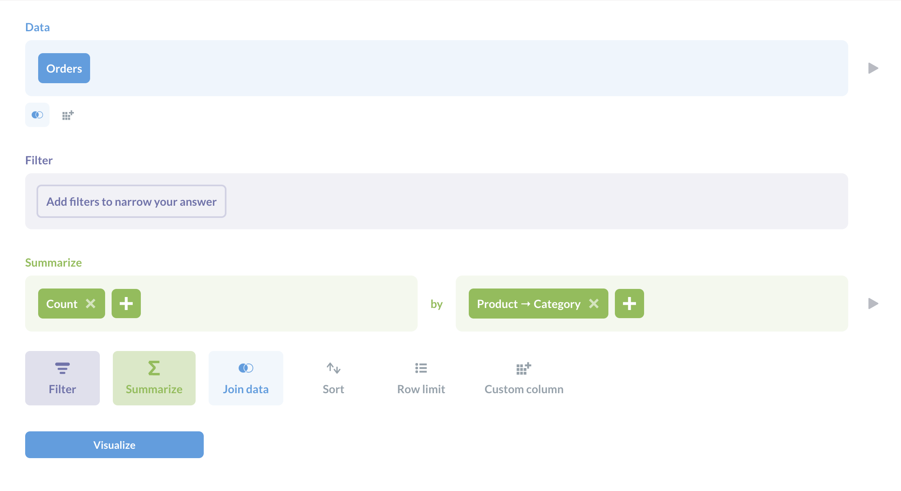
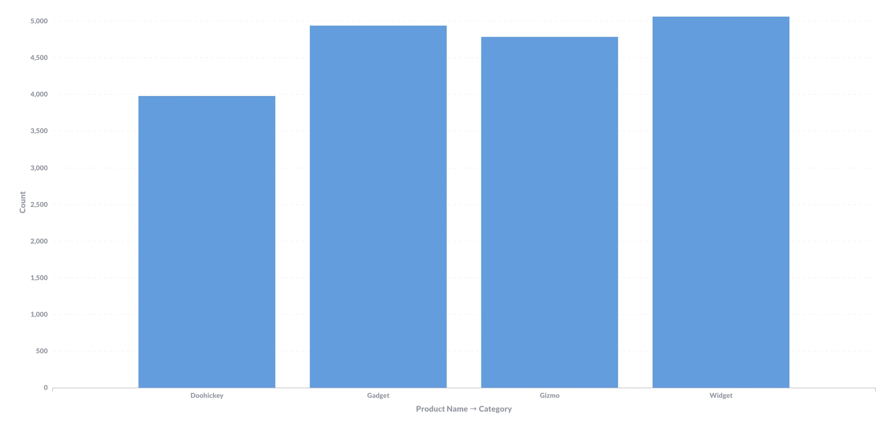
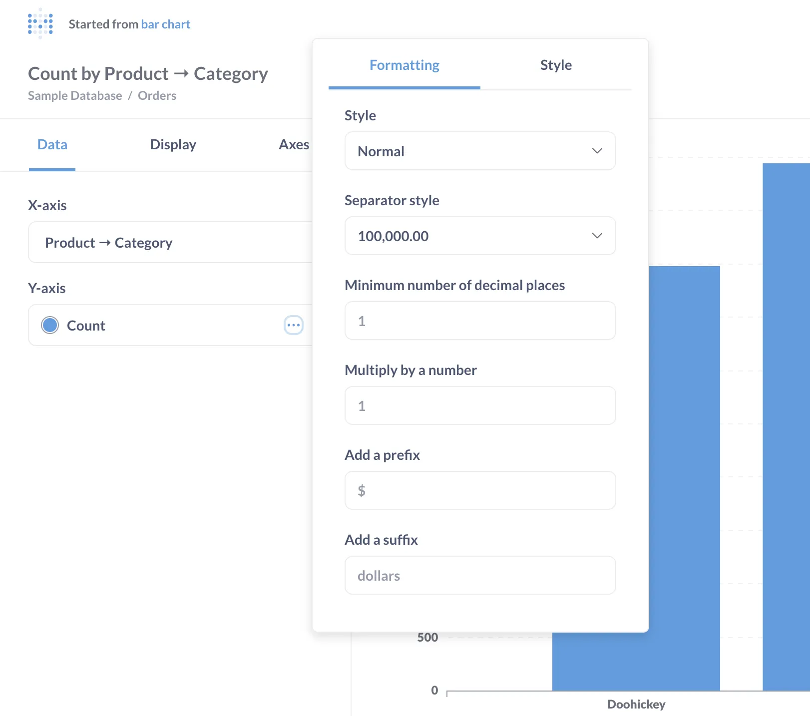
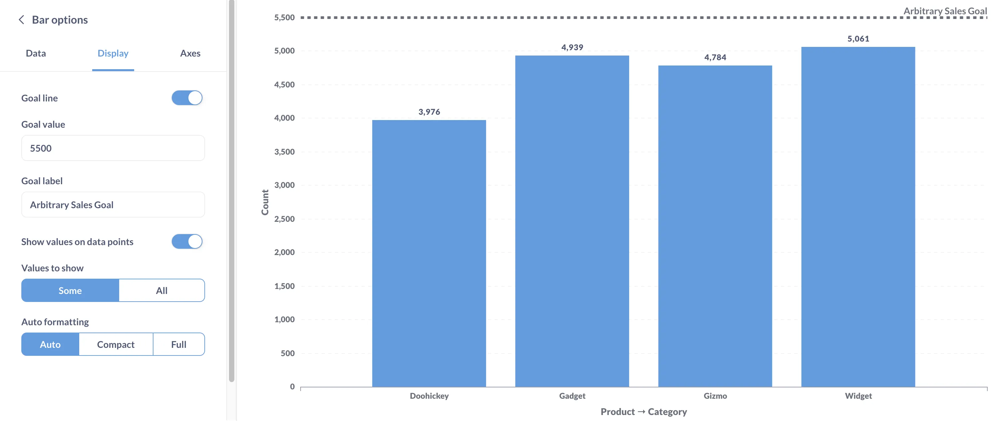
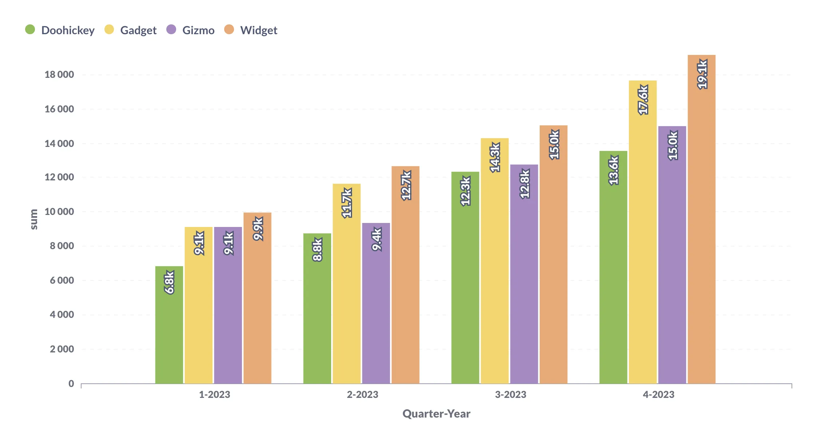
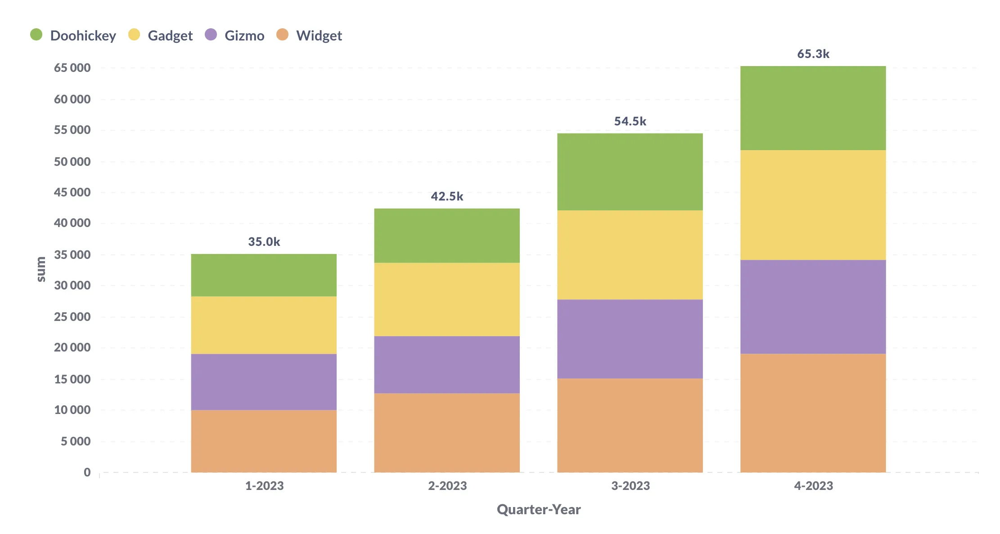
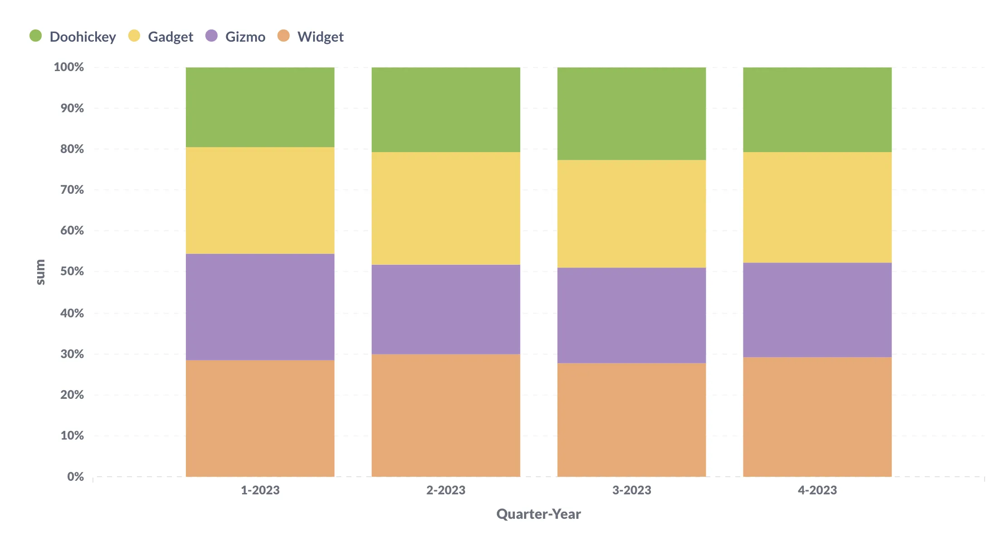

We'll walk through [creating a bar chart](#create-a-bar-chart) and [editing that bar chart's settings](#bar-chart-settings), then talk about [stacked bar charts](#stacked-bar-charts) and when we might want to use them.

## Create a bar chart

You can follow along using Metabase's [Sample Database](/glossary/sample_database). Select **+ New** > **Question** > **Raw data** > **Sample database**. Choose the Sample Database's `Orders` table as your data. Next, summarize the count of rows and group by Product -> Category.

Click **Visualize**, and Metabase will present the data as a bar chart:

## Bar chart settings

To customize the chart, click on the **gear** icon at the bottom left of the chart to open the settings sidebar, within the settings, you'll find the following tabs:

- [Data](#data)
- [Display](#display-settings)
- [Axes](#axes)

## Data

Here we can format and style our bar chart by clicking the `...` under Y-axis.
To change bar colors, click the color swatch and choose from the palette.

Customize your chart in the **Formatting tab** by adjusting numbers, separators, decimals, and scale. You can also add Prefix/Suffix as needed. In the **Style tab**, select colors, modify labels, choose a chart type (line, area, or bar), and position the Y-axis according to your chart preferences.

## Display settings

In the Settings > Display section, you can customize your chart in several ways:

### Add a goal line

This specifies where you want the values to be. Metabase can [alert](/docs/latest/questions/alerts) you when the values exceed (or drop below) that goal. For example, you can add a goal line at 5500 and name it 'Arbitrary Sales Goal'.

### Show values

Toggling on 'Show values' places the count values above each column.

### Add a trend line

When your data is summarized and grouped by a datetime field, you can add a trend lie. The trend line shows the general direction that your data is heading in over time. To add a trend line, simply toggle on the 'Trend line' option.

### Stacking options

When creating bar or area charts with multiple series, you can choose how the series are displayed with the stacking options. You can choose not to stack the series, stack them, or stack them at 100%.
We can also set the display to a [stacked bar chart](#stacked-bar-charts), which we'll get into in a bit.

## Axes

Select `Axes` in the **Settings sidebar**.

Here we can specify how we want our table organized.

### Label

Here we can hide or customize axes labels.

### Show lines and marks

With the **Show lines and marks** options we can change the way the categories and quantities are represented on each axis. The options for the y-axis are hide and show, while the x-axis has several more:

- Hide
- Show
- Compact
- Rotate 45˚
- Rotate 90˚

### Scale

We'll find three Y-axis scaling options:

- Linear
- Power
- Log

The linear option is selected automatically, and for our example provides the most accurate representation of our data, so we'll keep it.

## Stacked bar charts

If the data we're visualizing can be broken down into multiple categories within a whole, we could consider using a stacked bar chart. A 100% stacked bar chart is similar, but displays those parts as relative percentages, so every bar spans the full y-axis.

To create a stacked bar chart, click on **Settings** > **Display** and select either **Stack** or **Stack - 100%**.

Let's say we wanted to see how many orders were placed per product category across different quarters of a year. Here's that example displayed in three different bar chart styles:

### Don't stack

### Stack

### Stack-100%

Explore different display settings to tailor the visualization to your data and team preferences.

## Further reading

- [Visualization options](/docs/latest/questions/visualizations/visualizing-results#line-charts)
- [Setting default formatting for your data](/docs/latest/administration-guide/19-formatting-settings)
- [Create charts with explorable data](/learn/metabase-basics/querying-and-dashboards/questions/drill-through)
