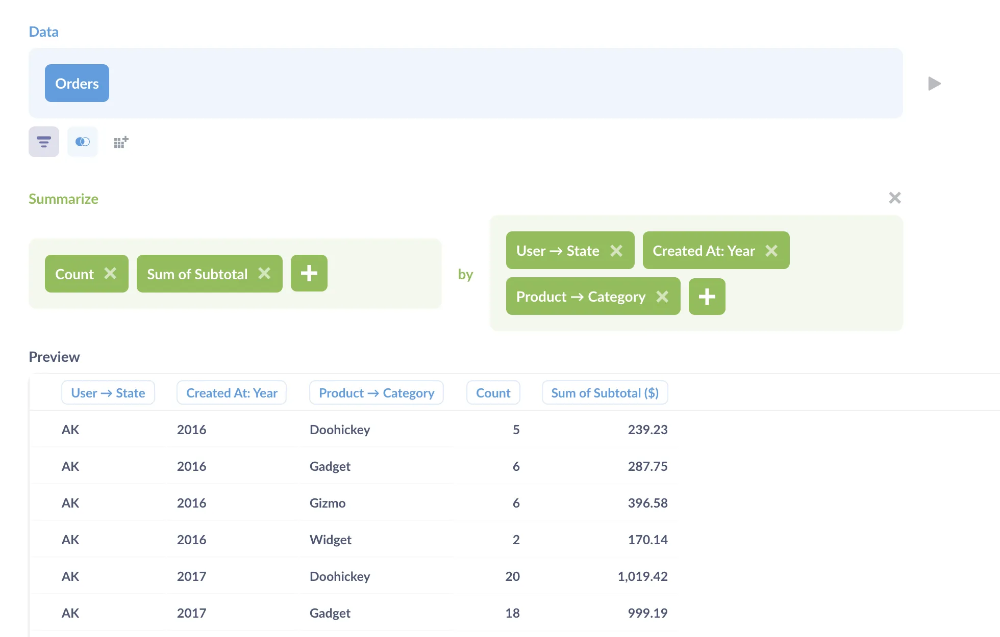
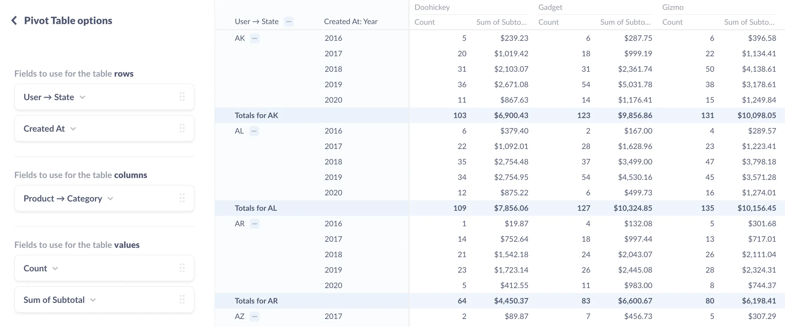
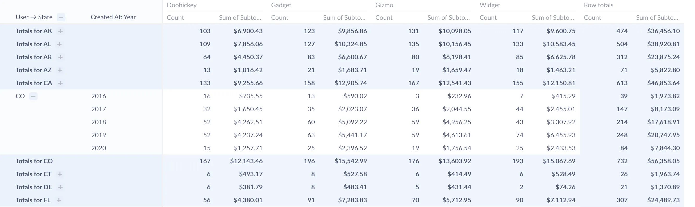
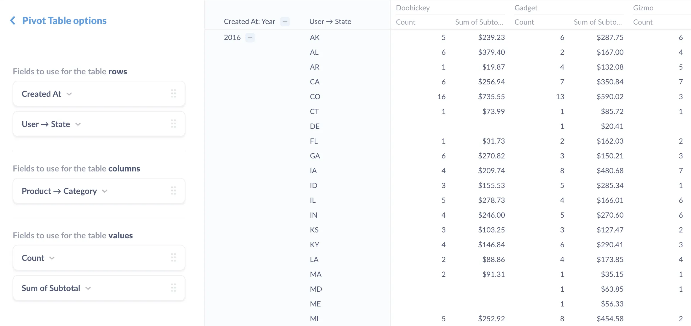
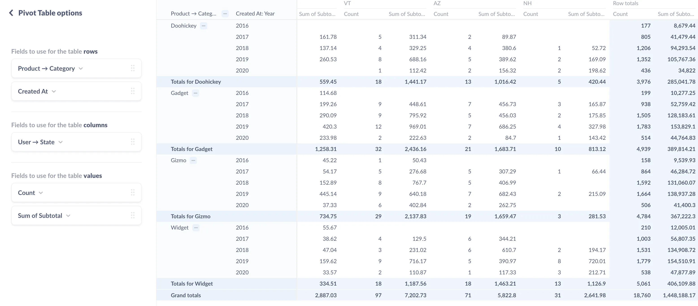
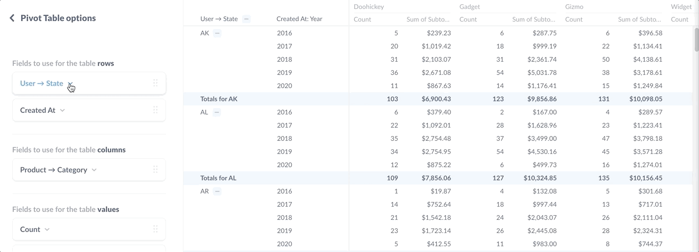
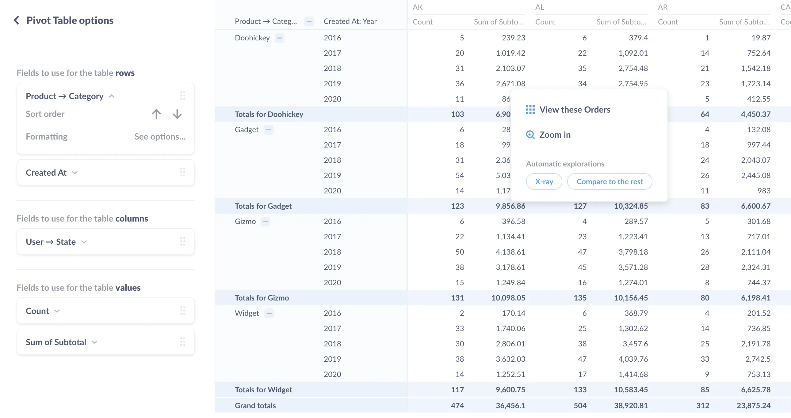
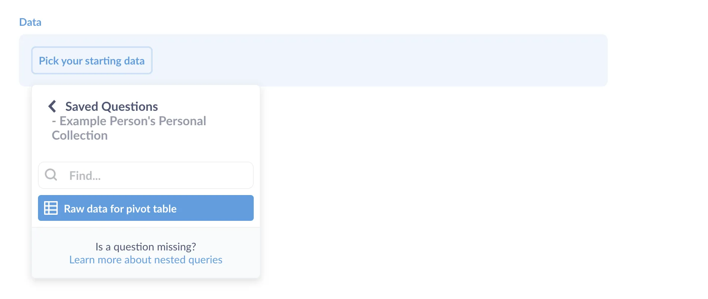
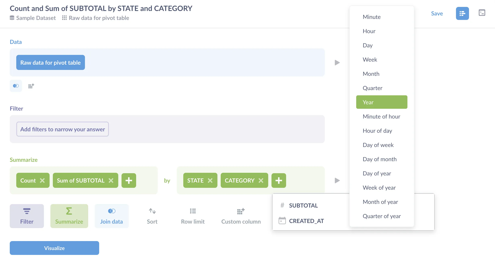



What is a pivot table? **Pivot tables** are a tabular way to summarize and group data. They're a valuable tool in the analyst's toolkit, as they're an efficient way to present and rearrange a lot of information. Here's how they work:

## Unsupported databases when creating pivot tables in Metabase

Pivot tables are currently unavailable for the following databases in Metabase:

- Druid
- MongoDB

Pivot tables work for all other [officially supported databases](/docs/latest/databases/connecting#connecting-to-supported-databases).

## Pivot tables vs. regular tables

Your typical, basic table is a grid of cells. Each column represents an attribute of a single record, with a single record per row.

A pivot table is a table that groups rows and columns, and includes summary rows with aggregate values for those groupings. These aggregate values are usually referred to as subtotals and grand totals, though these aggregates could also be other values, such as averages.

The reason they're called pivot tables is because you can rotate ("pivot") a column 90 degrees so that the values in that column become column headings themselves. Pivoting values into column headings can be really helpful when trying to analyze data across multiple attributes, like time, location, and category. You can pivot multiple rows to columns and vice versa, or not pivot any at all.

But this is all pretty abstract, so let's walk you through an example to give you a feel for how pivot tables work.

## How to create pivot tables: example

To start, let's say we want to know:

- How much annual revenue orders are bringing in
- For each state (i.e., where do our customers live?)
- and how those orders break down by product category

Here's our query using the **Query Builder**:



Here we're taking data from the `Orders` table and summarizing the records. We're grouping the orders by `User → State`, `Created At` (by year), and `Product → Category`. For each group (say Alaska in 2017), we count the number of orders and add up the subtotals for those orders. (Note that, even though we've only selected the `Orders` table in the data section, Metabase will automatically join the `Products` and `People` tables to get the State and Category data.)

The resulting table is a regular one, with rows for each combination of state, year, and product category.

Now, let's say that for each state, we also want to know the sum of the annual subtotals for each state (e.g., how much money did orders for Doohickey products make in Alaska for all years?). To find out, we could add up the subtotals ourselves, or use a pivot table to calculate that figure for us. At the bottom left of your screen, click **Visualization** > **Pivot table**.



In our pivot table, Metabase has set the rows, columns, and values as follows:

- rows: `User → State` and `Created At` (by year)
- columns: `Product → Category`
- values: `Count` and `Sum of Subtotal`

Like the flat table, the pivot table lets us see, for example, that in 2020 our customers in Alaska (AK) have purchased a combined 11 Doohickey products for $867.63. But now the pivot table has grouped the rows related to Alaska, and given a subtotal for those Alaskan rows, allowing us to see the answer to our question: Alaskans purchased 103 Doohickeys from 2016--2020, totaling $6,900.43.

In addition to the group subtotals, the pivot table also includes both row and column grand totals:

- Row grand total example: the total number of Doohickey orders placed across all states.
- Column grand total example: the sum of all subtotals in Alaska across all product categories.

We can navigate the table by collapsing and expanding groups of rows:



Now, let's try pivoting the table. In the bottom left of the screen, we'll click on **Settings**. To pivot the table, we'll move fields between the three buckets: rows, columns, and values.

Order _within_ a single bucket matters, so let's start by simply rearranging the table within a single bucket: the rows bucket. If we switch the order of fields to use for table rows, putting `Created At` above `User → State`, the table will rearrange itself:



Now the table groups first by year, then gives a breakdown of orders for each state across each product category.

We can also switch fields _between_ the buckets, like moving `Product → Category` from a column to a row, and `User → State` from a row to a column.



You can also turn off subtotals for a given row grouping:



Like with flat tables, we have some sorting and formatting options, and we can click on values in the table to bring up the drill-through menu, which will lets us [drill through the data](/learn/metabase-basics/querying-and-dashboards/questions/drill-through).



## How to create pivot tables: limitations

Pivot tables only work with relational databases that support joins and expressions, so you won't be able to use them with databases like MongoDB. They also only work with questions composed with the query builder. The workaround here is that if you must use SQL to compose a question, you can save that question, then use its [results as the starting point](/learn/sql-questions/organizing-sql) for a query builder question in order to build a question. The trick here is to do your aggregation and grouping in the GUI question. That is, use the SQL question to grab the raw data you want to work with (maybe [create a model](/learn/getting-started/models)), then start a new GUI question to filter, summarize, and group that data.

For example, to use a SQL question to build the pivot table we created above, you'd first write a SQL query to get the raw data you want to work with:

```sql
SELECT people.state,
       products.category,
       orders.subtotal,
       orders.created_at
FROM   orders
       INNER JOIN products
               ON orders.product_id = products.id
       INNER JOIN people
               ON orders.user_id = people.id
```

Notice that we're just grabbing records here; there's no summarizing or grouping. Next, we save that SQL question (here as `Raw data for pivot table`), and start a new query builder question that uses the results of that question as its starting data.



Now we can count, sum, and group our results:



When we visualize this question, we'll now be able to use the pivot table visualization to see the group subtotals and grand totals.

## Further reading

- [Visualization types](/docs/latest/questions/visualizations/visualizing-results)
