Line charts are good for plotting data captured in a sequence, whether that sequence is the passage of time, or steps in a process or flow. These charts are typically used to plot a time series (also known as a run chart): a set of markers connected by lines, with the x axis showing the passage of time and the y axis plotting the value of a metric at each moment.

## How to create a line chart

Let's take a look at the `Orders` table in the [Sample Database](/glossary/sample_database) that ships with Metabase. From the main navigation bar, click on **+ New** > **Question**, which will take you to Metabase's query builder. Choose **Raw Data** > **Sample Database**, then pick the `Orders` table. Click **Visualize**, then click the **Visualization button** in the bottom right to bring up the **Visualization sidebar**.

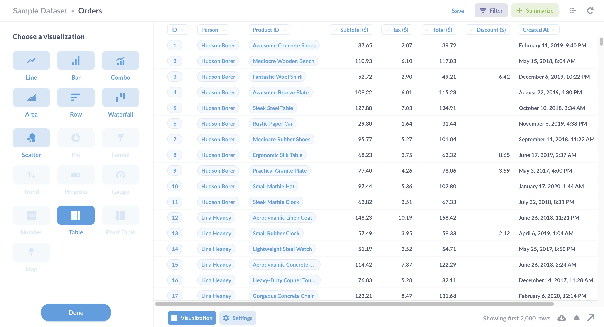

Let's start with how _not_ to create a line chart. If you select **line chart**, Metabase will present you with an empty line chart.

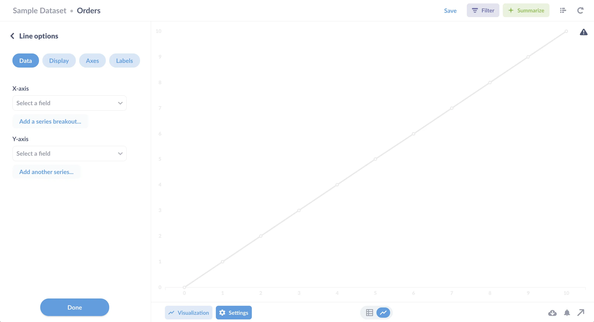

Metabase can't read minds (yet), so it doesn't know which columns from the `Orders` table to use for the x and y axes. To create a line chart, you'll need to pick a metric for Metabase to plot over time. For example, you could show order totals over time by setting the x axis to `created_at` and the y axis to `total`. Metabase will automatically plot the line chart:

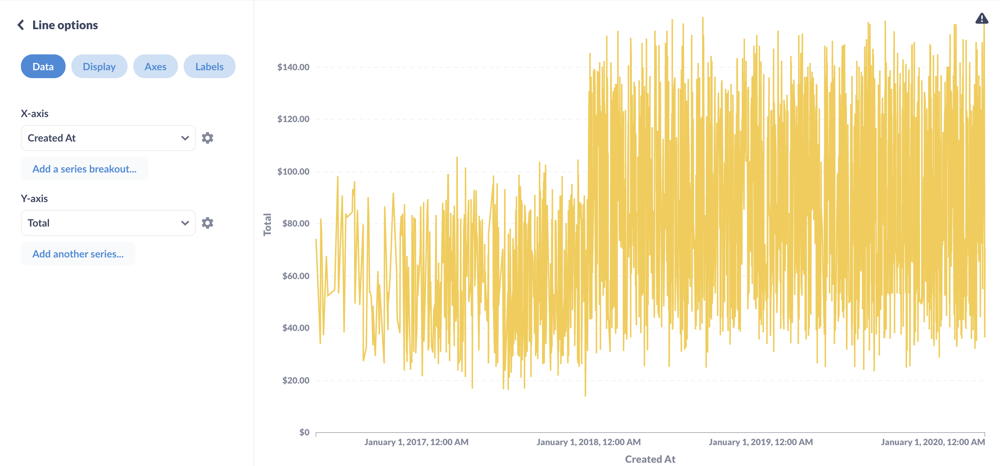

That's technically a line chart, but it looks more like the cardiograph of a startled hummingbird, and that's even after Metabase has truncated the results shown. (If you hover over the gray warning triangle in the upper right, you'll see that Metabase has only plotted 2,000 rows.)

To make the chart more legible, we can summarize the data, so each point on the line chart is an aggregate of rows---"buckets" of records. (It's much more common to plot unaggregated rows in visualizations like [pin maps][pin-maps], or a [scatterplot][scatterplot], e.g., to show each product plotted by price and rating.)

As an example of an aggregated metric, let's plot the sum of order totals for each month. Click on the green **Summarize button** to pull up the **Summarize sidebar**. Metabase defaults to counting the records, but we're not interested in the number of orders, so we'll click on `Count` and change it to `Sum of` and select the `Total` column from `Order`.

Next, we'll want to group our order totals by month. In the **Group by** section, under `Order`, mouse over the `Created At` field click on the `+` button to add the grouping.

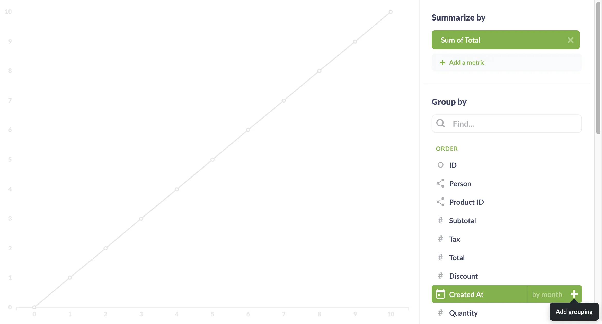

As soon as you add the grouping, Metabase updates the chart:

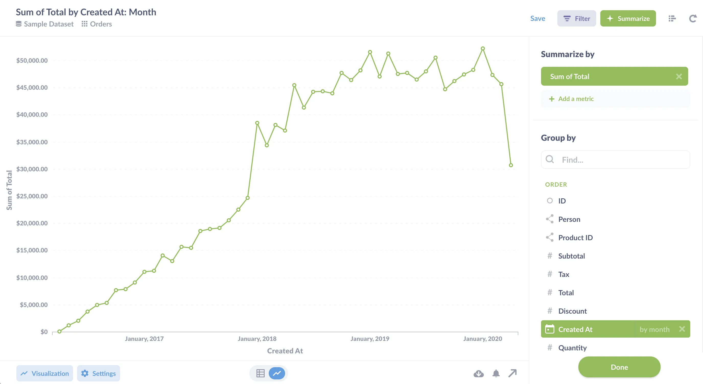

This chart is a lot easier to read. And, of course, we can always select a section of the line to filter the results for that time period, and drill through to see those individual, unaggregated records.

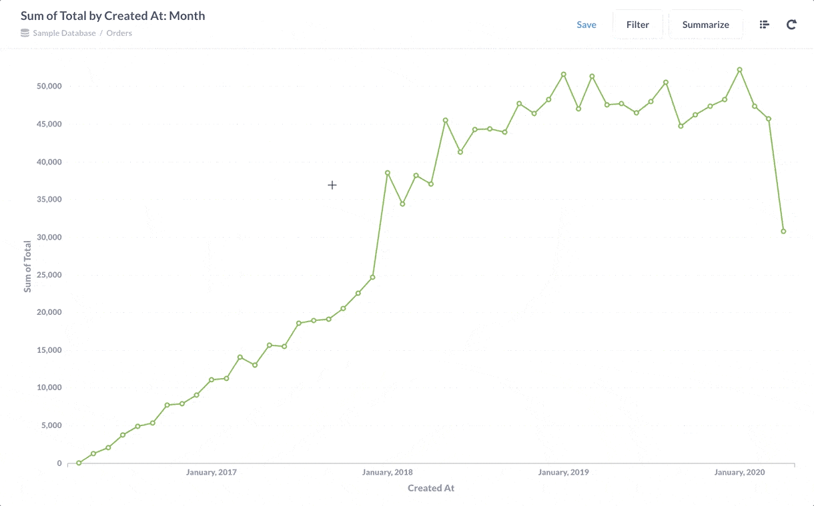

## Customizing your line chart

To customize your line chart, you can click on the **Settings** button in the bottom left. There are too many settings to cover here without boring you, so we'll just give you some highlights.

### Display tab

The **Display tab** lets you change the line color and style, handle missing values, and so on. If you plan on embedding your chart in your app, check out our [white labeling option][white-label] for even more customization.

#### Trend lines and goal lines

You can add a trend line from the display settings of a time series chart. You'll see the toggle if you've chosen exactly one time field from **Summarize** > **Group by**. In the example below, we've chosen the grouping field "Created At: Month":

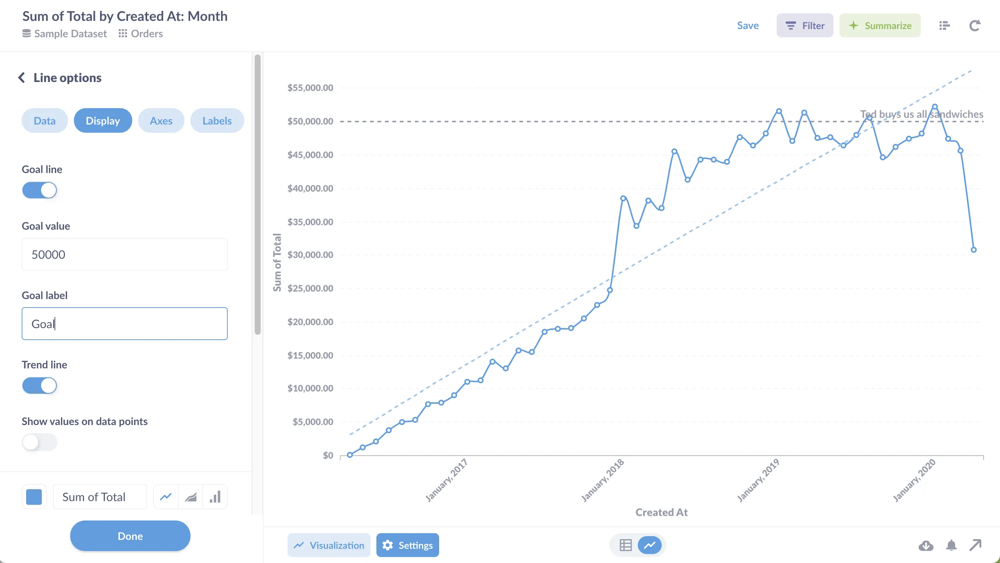

You can also add a goal line to plot a horizontal line at your goal value. Goal lines are especially useful when paired with alerts. For example, if you're monitoring sales, and you only want to get notified if a metric dips below a certain threshold, you can add a goal line to specify that threshold and get an email or have a Slack message sent when the line goes under it.

#### Line, area, or bar chart?

We've been talking strictly about line charts so far, but [bar charts][bar-chart] and area charts are similar, and there are good reasons to choose them instead of a line chart, depending on what you're trying to communicate:

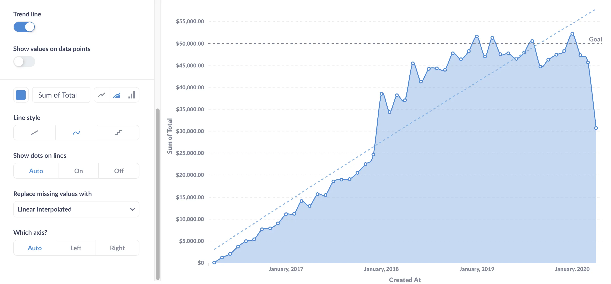

Area charts are typically used to compare values over time. If you don't have that many values plotted over time, consider a bar chart. If you want to see the composition of values over time, use a stacked bar chart.

You can also combine line and area charts in a [combo chart](/docs/latest/questions/visualizations/combo-chart) to visualize different aggregations, like the count and sum of order totals shown below. We discuss combo charts in more detail [here][combo-chart].

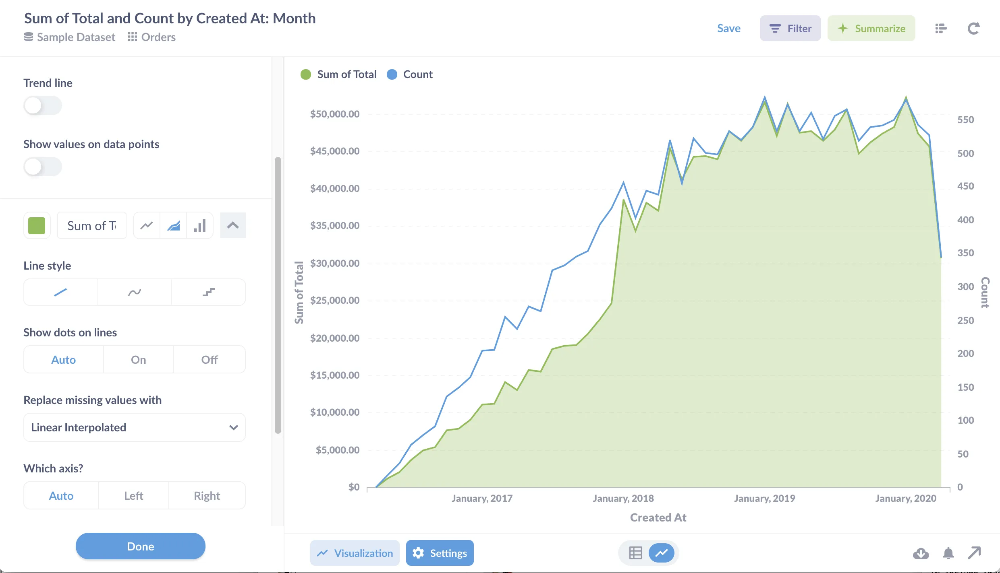

### Axes tab

Here you can adjust the scale of the x and y axes. For the x axis, you can select either time series or ordinal scales. Time series will limit the number of values displayed, whereas the ordinal scale will list each value in the series along the x axis. Use an ordinal scale if you're plotting steps in a sequence.

For the y axis, you can select linear (the default), or power or log scales. Logarithmic scales are great for showing the rate of change over time, especially when your data has an exponential rise or decay.

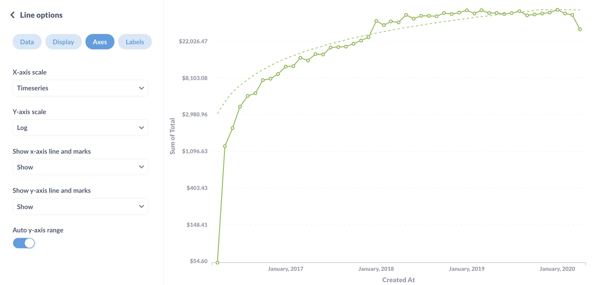

And you can probably just ignore power scales, as no one really uses them.

## Line chart tips

Metabase takes care of a lot of the best practices for visualizing data for you, but here are some tips to keep in mind when creating line charts.

### Pair a line chart with a trend chart

When creating a dashboard, you can pair a line chart with a [Trend][trend] chart to make the latest value easy to read.

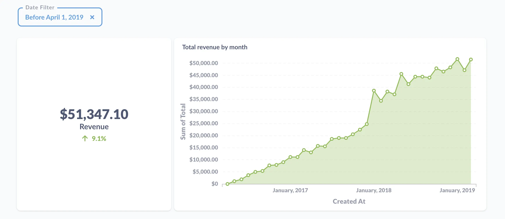

### Hover over a label to highlight a line

You can hover over the name of one of your series in the legend to highlight it and make the others fade out. You can also click on a series to hide (or unhide) it.

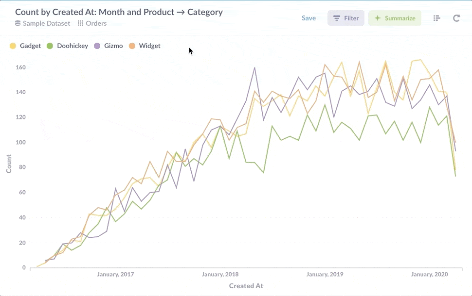

### For time series, filter out any time period still in progress

When dealing with time series, your charts can look nicer if you add a filter to exclude the day, week, or month that's currently in progress; otherwise your chart will have a huge drop on the far right because of the partial or incomplete time period. Just uncheck the **Include this day** or week, month, or whatever time scale you're working with.

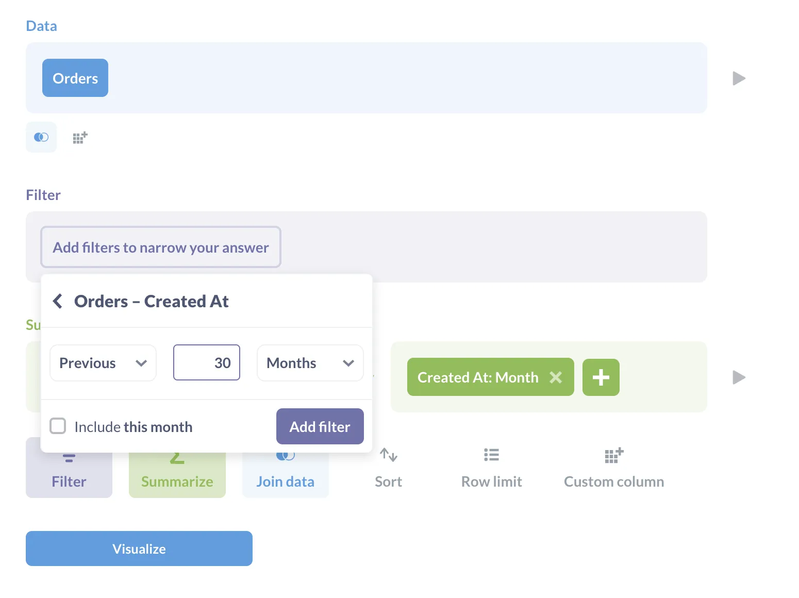

## Further reading

- [Multi-series charting][multi-series]
- [Line charts documentation][line-charts]
- [Time series comparisons][time-series]
- [Which chart should you use?][which-chart]

[bar-chart]: /learn/visualization/bar-charts
[combo-chart]: /docs/latest/questions/visualizations/visualizing-results#combo-charts
[line-charts]: /docs/latest/questions/visualizations/visualizing-results#line-charts
[multi-series]: /docs/latest/users-guide/09-multi-series-charting
[pin-maps]: /docs/latest/questions/visualizations/map
[scatterplot]: /docs/latest/questions/visualizations/visualizing-results#scatterplots-and-bubble-charts
[time-series]: /learn/analytics/time-series-comparisons
[trend]: /docs/latest/questions/visualizations/visualizing-results#trends
[which-chart]: /learn/basics/visualizing-data/guide
[white-label]: /learn/developing-applications/advanced-metabase/brand
