Tables are data's natural habitat, with their columns and rows corresponding to the fields and records of relational databases. They may not be as "visual" as a [bar chart](/learn/visualization/bar-charts) or a [map](/docs/latest/questions/visualizations/map), but they're often what you need when you're working with a lot of fields. The table visualization in Metabase comes packed with features---some automatic, and some you can customize for yourself. In this article, we'll work with the `Orders` table in the [Sample Database](/glossary/sample_database) included with Metabase to explore the table visualization and lay bare its secrets.

## The table visualization

To start, we'll select **+ New** > **Question** > **Raw data** > **Sample database** > **Orders**. And just to be clear on terms here, the `Orders` table is the set of relations in the database that houses the Sample Database. This table is distinct from the table visualization, or just "table"---which is the graphical representation of the data in the table, and the occasion for this article.

Once we click **Visualize**, here's our basic table:

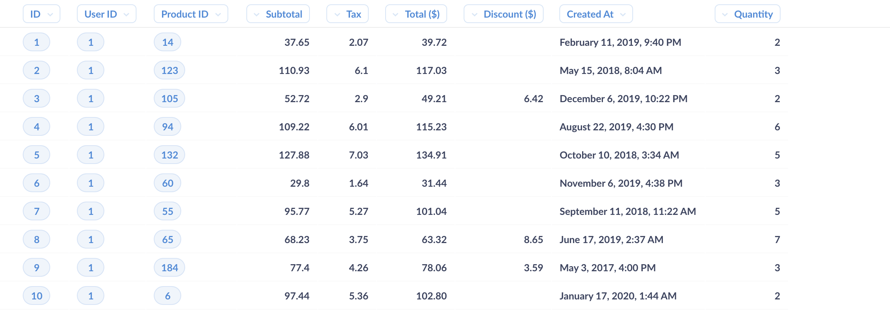

## Table visualization basics

It might not seem so special at first, but there's already a lot going on. So before we customize our table, let's go through the features that come with it out of the box.

### Column actions

The options Metabase presents for each column differ depending on the type of data. For example, if you click on the heading of the `Total($)`, Metabase will present a set of options, like `Distribution`, `Sum`, `Average`, and so on. If you clicked on the `Created At` column, you'd get a different set of options, as it wouldn't make much sense to take the average date, for example.

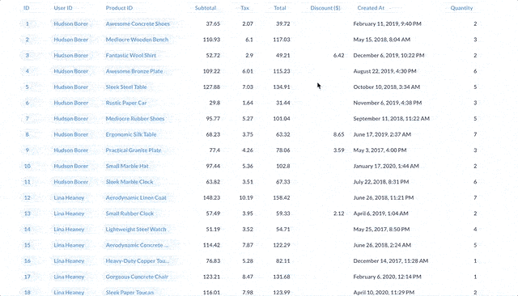

From the line chart, you can continue to [drill through the data](/learn/metabase-basics/querying-and-dashboards/questions/drill-through), like zooming in the orders in a section of the chart, or by clicking on a month to view those orders as a table.

Similarly, if you click on a value in one of the columns, Metabase will present a menu that gives you some options depending on the type of data in that column. For instance, by clicking on a value in the `Total` column, Metabase will present options to filter the data in relation to that value: greater than, less than, and so on.

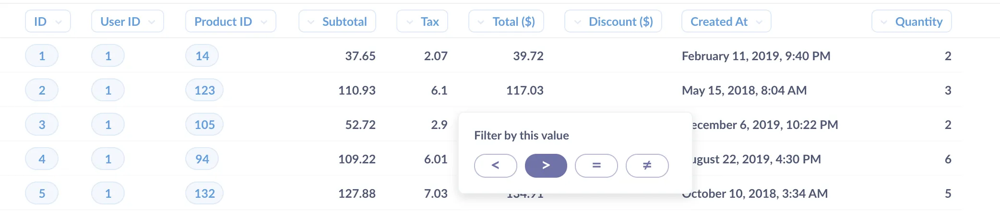

### Detail views

To make records easier to read, you can click on an [entity key](/glossary/entity_key) column (either a primary or foreign key) to bring up a detail view. For example, clicking on the order `ID` of "3" will bring up details from that order from the `Orders` table.

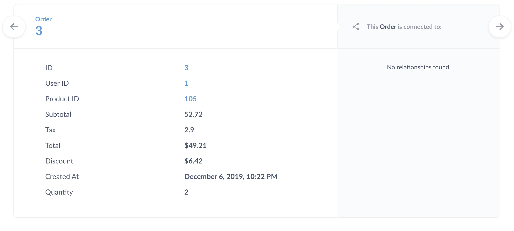

## Customizing our table

Now let's see if we can spruce up our table a bit.

### Column settings

You can change settings for each of the columns by either clicking on a column's heading and selecting the **gears icon**, or via the **Settings sidebar**. Metabase will include additional columns from other tables linked via foreign key.

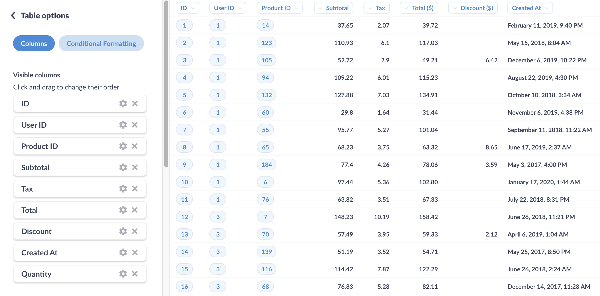

Once again, Metabase knows to present different options for different types of data. For example, for scalar values, you can add a **mini bar chart** to show the value's position within the range of values in the column.

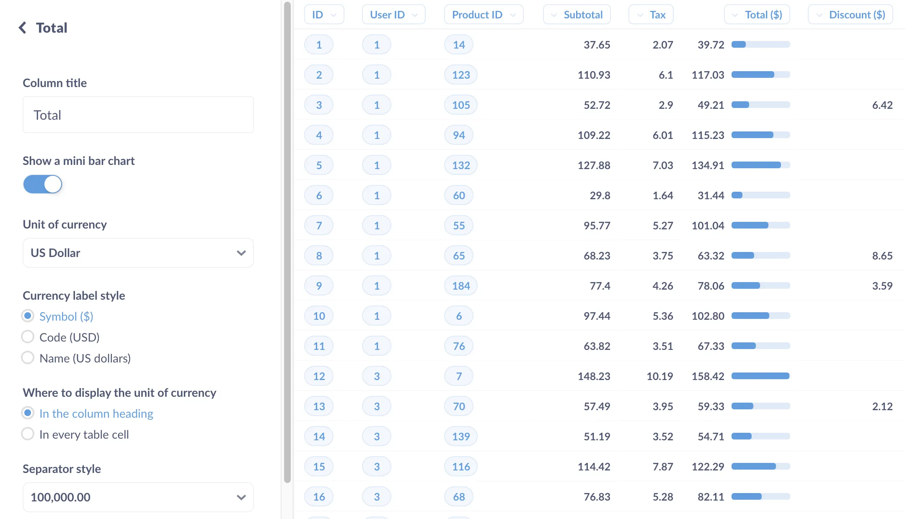

### Conditional formatting

You can highlight cells or rows based on the values they contain, which makes it easier for people to see value ranges and outliers. There are two types of conditional formatting: _single color_ and _color range_. When you want to color a cell or row if a value in cell meets a certain criteria, use the single color option.

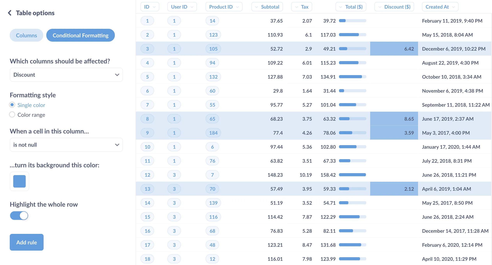

If instead you want to show the value's relative position in the range of values for a column (or multiple columns), use the color range option (it's a subtler version of the mini bar chart).

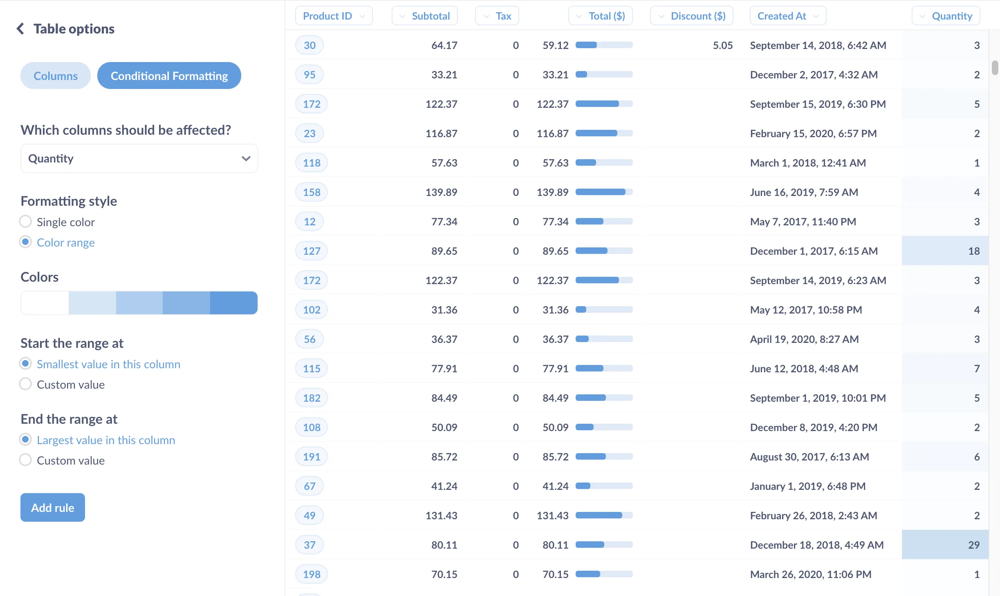

### Adding, removing, and editing columns

You can select which columns you'd like to include in the table. If your table includes foreign keys, Metabase will automatically make available fields from those tables that you could add to your table. Since the `Orders` table includes foreign keys from the `People` and `Products` tables, you can select columns from those tables to add to your table.

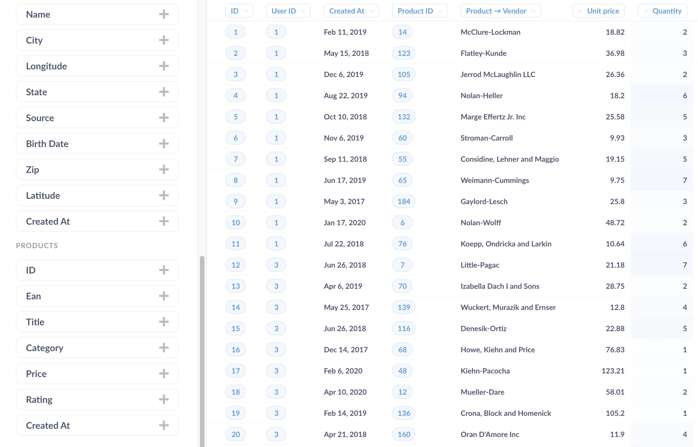

If you need to add a column from another table (say, the `Reviews` table), you'll need to join that table in order to get access to those columns. To learn how, see [joins in Metabase](/learn/metabase-basics/querying-and-dashboards/questions/joins-in-metabase).

You can remove a column by clicking on the X next to the column in the column settings. To rearrange columns, simply drag and drop a column, either on the table itself, or in the **Settings sidebar**.

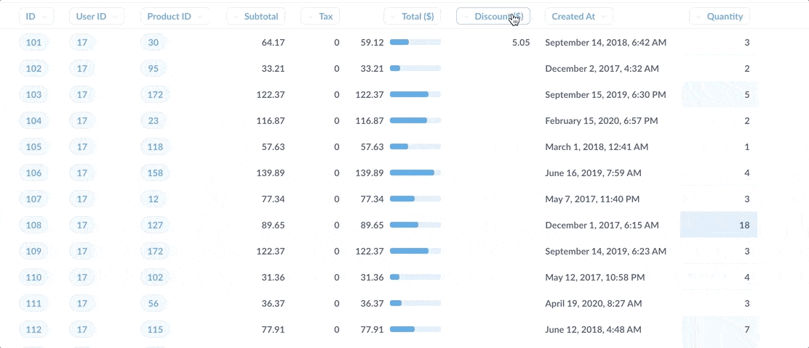

## Custom columns

You can create custom columns using the **Query Builder**. Let's say you want to include a column that lists the unit price of the product ordered, which we'd calculate by dividing the `Subtotal` by the `Quantity` orders. Open up the **Query Builder**, and select the **Custom Column** option. Enter the calculation in the **Field Formula** input box, and then give it a name.

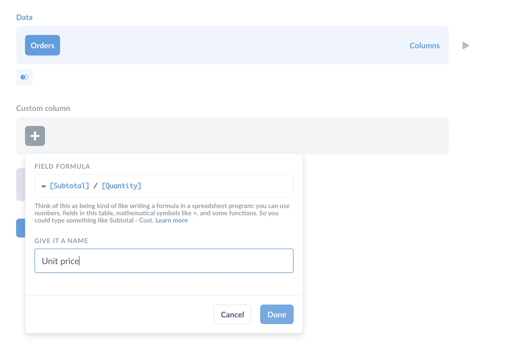

To learn more about what you can do with field formulas, check out our article on [custom expressions](/docs/latest/questions/query-builder/expressions) in the **Query Builder**.

## Foreign key remapping

Here's one last cool feature, though it requires an admin to change some settings in the Data Model section. Foreign keys are useful, but they're generally not meaningful for (human) readers. Instead of displaying a foreign key as a number, say a product ID, it'd be nice to display the values as the product's `Title`. Metabase can substitute foreign keys with values from the foreign table that are associated with that entity key. What this means is that instead of showing the `Product_ID` value, you can set it up so that people will instead see the product `Title`, like "Lightweight Wool Computer." Your Metabase admins can set this up in the **Admin Panel** in the **Data Model tab**. In this case, we'll select the `Orders` table, and change the foreign key from the `Products` table to instead display in the Order table as the `Product → Title`.

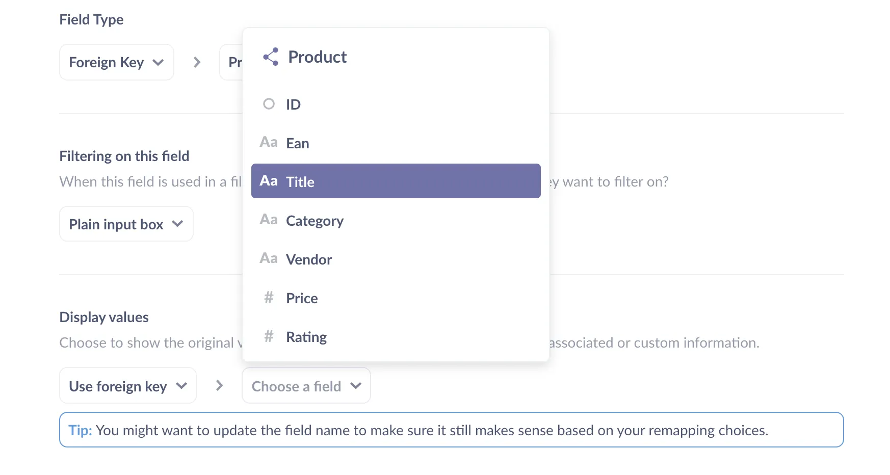

## Adding tables to dashboards

When you add a table to a dashboard, you can add [custom destinations](/docs/latest/dashboards/interactive#custom-destinations) to individual columns, wire up filter widgets, and more. To see an example of a table used in a dashboard, check out our article on [building a record lookup tool with Metabase](/learn/analytics/build-a-record-lookup-tool).

## Further reading

- [Building a record lookup tool with Metabase](/learn/analytics/build-a-record-lookup-tool)
- [How to create a pivot table to summarize your data](/learn/metabase-basics/querying-and-dashboards/visualization/how-to-create-pivot-tables)
- [Searching your tables and questions](/learn/analytics/searching-tables)
