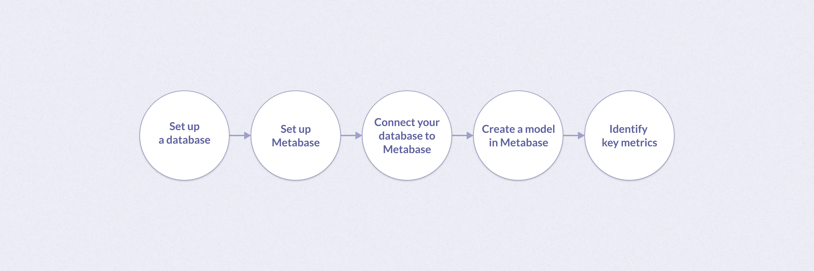

## Why a metrics store

A good metrics store will be able to help answer some of your most important questions:

- How has your business been doing? Can you breakdown how your business has been progressing in different domains?
- What happens if things just keep going as they’ve been going? What will the numbers look like next quarter? Next year?
- What happens if you were instead to target one or more metrics and increase or decrease them? How would those changes affect your target outcomes?
- How much runway do you have?
- How many people should you hire this year?

## Set up a database

This guide assumes you already have a database set up. If you don't have a database yet, you can quickly set one up using [Postgres](https://www.postgresql.org/docs/current/tutorial-createdb.html) or see our guide on the [different types of databases](/learn/grow-your-data-skills/data-fundamentals/types-of-databases) to decide on another.

You can use [ETL](/learn/analytics/etl-landscape) (extract, transform, load) tooling to move data from your application to your database. Here are a few recommendations to get started:

- [Fivetran](https://www.fivetran.com/data-movement): Offers a free trial and [connectors](https://www.fivetran.com/connectors).
- [Stitch](https://www.stitchdata.com/): Offers a free trial and [integrations](https://www.stitchdata.com/).
- [Airbyte](https://airbyte.com/): If you’re looking for an open source solution.

Once you have data in your database, you can move on to setting up and connecting to Metabase.

## Set up Metabase

There are two basic ways to [get started with Metabase](/blog/how-to-run-metabase-in-production):

- [Cloud](https://store.metabase.com/checkout): We host Metabase for you so that you can focus on using it, rather than running it. Create an account and follow the checkout process. This will walk you through the steps of choosing a plan and getting set up with your basic installation.

- [Self-hosting (OSS)](/start/oss/): Follow the [OSS installation instructions](/docs/latest/installation-and-operation/installing-metabase) to use either the Docker image or pre-built .JAR file.

## Connect your database to Metabase

You may have already set up your database during sign-up. However, if you need to add a database connection, click on the gear icon in the top right of Metabase, and navigate to **Admin settings** > **Databases** > **Add a database**. See [our docs](/docs/latest/databases/connections/postgresql).

## Create a model in Metabase

Data modeling helps illustrate the types of data you plan to use, and build connection between multiple data points.

Working with raw data can lead to inconsistent data values, or incorrect/bad data rows. To better visualize the structure of your data in Metabase, we suggest creating a data model first.

With a data model, you'll be able to:

- Maintain data accuracy.
- Standardize data for multiple use cases.
- Clean and organize your data so that's it's best suited for analytics.
- Identify and fix issues faster.

Data modeling also helps enrich your data. For example, you'll now be able to add columns, or rename columns and values.

### Different types of models

There are many different types of [data models](/learn/data-modeling/models), such as logical/physical models like [relational](https://medium.com/@daryl.ung/data-warehousing-basics-of-relational-vs-star-schema-data-modeling-75a68eeaf0e3), [star schema](https://www.fivetran.com/blog/star-schema-vs-obt), or [flat table (also known as wide tables or OBT)](https://hightouch.com/blog/data-warehouse-modelling-part-2) models.

For data warehousing, star and flat table models are most commonly used. However, flat tables are becoming more commonly used by businesses as they can better support end-users, too.

As the end goal is to import your metrics into a spreadsheet, we suggest modeling as a flat table in Metabase. By organizing your data into one flat table, you can see all of your data in columns and rows, similar to a spreadsheet.

### Create a flat table model in Metabase

First, select **New +** > **Model** in the upper right corner. Next, select the query builder option and select your database. Choose the data you’d like to add to your model. Save the model.

You data will automatically be put into columns and rows, like a flat table. You can then edit and add metadata to finalize your model.

#### Add and edit metadata

Adding metadata to your model can help consolidate data for self-service use. For example, multiple people can pull from the same data without ambiguity of what the data represents.

Metabase also uses metadata to present filters for use on columns, and to enable drill-through questions on charts.

To add or edit metadata in a model, click the Metadata button at the top of your model. Here you can edit column name, type, description, and how it appears or is displayed.

## Identify key metrics

With your modeled data, you can now identify key metrics for your metrics store.

A metric, in this definition, is any measure that is quantifiable. You can use metrics to create time series, which will help you track and visualize data trends, cyclic changes, seasonal changes, and irregularities.

The benefit of metrics and time series here depends on your use case. For example, in the case of financial modeling, you can import these metrics into a spreadsheet to create actuals, projections, and inputs for modeling alternative scenarios.

If you're new to metrics and not quite sure what to track, see our blog post on [how to develop the most important metrics for your business](/blog/develop-a-metrics-store-now) first. The walkthrough below also gives context of how to identify key metrics when creating a question in Metabase.

### Create a question

When you're ready to create metrics, create a [question](/glossary/question) in Metabase. From the **+ New** dropdown, select Question, then select your model.

Questions in Metabase are queries plus their results and visualizations. Typically, data teams write SQL queries to retrieve data from a database. The Metabase [SQL editor](/docs/latest/questions/native-editor/writing-sql) operates in the same fashion.

However, using the Metabase [query builder](/docs/latest/questions/introduction#query-builder) when creating a question gives you additional drill-through capabilities with your visualizations.

Use the query builder to choose specific data from your data model table and [summarize the data](/docs/latest/questions/introduction). This summary is made up of two parts: one or more aggregate numbers you care about (called a “metric” in data-speak), and how you want to see that number grouped or broken out.

Some common metric suggestions, like average, will already appear under **Summarize**. You can use these metrics, or identify your own. There are two common ways people tend to summarize data: counting the number of rows in your table, or getting the sum or average of a numeric column.

As an example, to answer the question “How many people downloaded our app each day last week?”, you'd create a metric that **counts** the **number of people who downloaded the app**. You'd group the metric by “each day”. And you'd filter the rows for “last week”.

Use the query builder to build out your summary and, if needed, [group](/docs/latest/questions/query-builder/summarizing-and-grouping) your [metric](/docs/latest/questions/introduction) by time, place, category, etc.

You can also use [custom expressions](/docs/latest/questions/query-builder/expressions), which operate like formulas and functions found in spreadsheet software, to establish more complex metrics.

For example, there are a few [scenarios](/docs/latest/questions/query-builder/expressions-list) where you may need to use a custom expression, like creating a [custom column](/docs/latest/questions/query-builder/expressions-list) to calculate specific metrics like [NPS score](/blog/create-and-analyze-a-nps-survey-the-right-way).

Save your question, and this will save your metric.

You can even build new models from your saved metrics. For example, if you are creating business metrics, like monthly ARR, you can [turn your monthly ARR question into a model](/docs/latest/data-modeling/models#create-a-model-from-a-saved-question).
