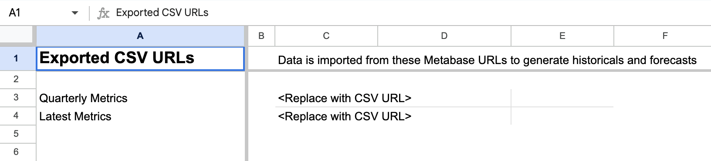

## Financial modeling package

The [financial modeling package](https://github.com/metabase/financial-modeling-package) will help you set up a [metrics store](/startup-guide/metrics-store/overview) in Metabase that you can use to populate a [template spreadsheet](https://docs.google.com/spreadsheets/d/1wG1p-wj9k3AxLeZcRvTVNgxJdiEaOXof-0heoHGkvpM/edit?usp=sharing) with your financial data.

You can then use the spreadsheet to:

- Track historical metrics for revenue and number of customers.
- [Forecast growth](/startup-guide/metrics-store/projections) and play around with [alternative scenarios](/startup-guide/metrics-store/scenarios).

The package is under the [MIT License](https://github.com/metabase/financial-modeling-package/blob/main/LICENSE), so have fun with it.

## Overview

The [financial modeling package](https://github.com/metabase/financial-modeling-package) creates a metrics store from Stripe data in your Metabase, which you can then use to import into our [financial modeling template](https://docs.google.com/spreadsheets/d/1wG1p-wj9k3AxLeZcRvTVNgxJdiEaOXof-0heoHGkvpM/edit?usp=sharing).

The package uses the `dap` CLI (dap is short for "data products"), which does the following:

- Creates a series of models and questions from Stripe data stored in your PostgreSQL database.
- Makes the results of some Metabase questions available in CSV format via a public link.

From there, you can import that CSV data into our [Financial Model Template](https://docs.google.com/spreadsheets/d/1wG1p-wj9k3AxLeZcRvTVNgxJdiEaOXof-0heoHGkvpM/edit?usp=sharing), and have a fully functional spreadsheet to view historical data and play around with forecasting and scenario modeling by adjusting certain values.

## Prerequisites for the financial modeling package

For the `dap` command to work its magic, there are a fair number of boxes you'll need to check:

- **MacOS and Homebrew**. We've tested this on MacOS using [Homebrew](https://brew.sh/) to install the required packages.
- **Stripe data ingested by Fivetran**. `dap` expects the Stripe data to be in a certain "shape", as ingested by [Fivetran](https://www.fivetran.com/).
- **PostgreSQL**. That Stripe data must be stored in a PostgreSQL database.
- **Google Sheets**. You'll need access to [Google Sheets](https://www.google.com/sheets/about/).

You'll also need a [Metabase](/) up and running with the following setup:

- Admin email/password for a Metabase. The `dap create` command requires an admin account to create models/questions via your Metabase's API. The admin account _must_ be created using an email address; admin accounts created with SSO won't work. If you're using SSO, you can simply create an additional admin account using email and password specifically for this use case.
- [Public sharing](/docs/latest/embedding/public-links) turned on.
- Your Metabase must be accessible from the internet (so that Google Sheets can import data from that Metabase).
- [Model persistence](/docs/latest/data-modeling/model-persistence) enabled in your Metabase. Otherwise your Metrics will time out before the Google Sheet can import them.

As you can see, this is a pretty specific setup. But even if you don't meet the criteria, you can still pick up a lot just by walking through the [SQL in the repo](/startup-guide/package/models), the setup of our [financial modeling template](/startup-guide/package/template), and our info-dump on [financial modeling concepts](/startup-guide/financial-modeling/overview).

## How to get your data into the financial model template

Here's the basic overview of what you'll be doing:

- [You'll copy the Financial model template](#copy-the-financial-model-template)
- [Clone the Financial modeling package repo](#clone-the-financial-modeling-package-repository)
- [Install the repo's dependencies](#install-dependencies)
- [Get info about your Metabase and your Stripe data](#get-info-about-your-metabase-and-stripe-data)
- [Set up a Python virtual environment](#set-up-a-python-virtual-environment)
- [Run the `dap` commands and plug in your info](#run-the-dap-commands)
- [Copy and paste the Metabase CSV URLs into your Financial Model Template](#copy-and-paste-the-metabase-csv-urls-into-your-financial-model-template)

You can the optionally add [custom metrics](#custom-metrics) to the sheet.

It's a fair amount of setup, so let's walk through it.

### Copy the Financial model template

Create a copy of the [Financial Model Template](https://docs.google.com/spreadsheets/d/1wG1p-wj9k3AxLeZcRvTVNgxJdiEaOXof-0heoHGkvpM/edit?usp=sharing). In the template go to **File** > **Make a copy**.

### Clone the Financial modeling package repository

Clone the [Financial modeling package repo](https://github.com/metabase/financial-modeling-package).

Install `gh` CLI by either following the [instructions on github.com](https://cli.github.com/), or (if you're using MacOS), you can install via the [homebrew](https://brew.sh/) package manager by running:

```console
brew install gh
```

Once installed, run the following command to clone this repo:

```console
gh repo clone metabase/financial-modeling-package
```

### Install dependencies

```console
brew install python3 tox
```

### Get info about your Metabase and Stripe data

- **Your Metabase URL** (the homepage of your Metabase).
- **A Metabase admin email and password**. SSO accounts won't work, so you made need to create an admin account via email and password.
- **Stripe schema**. The name of the `stripe` schema ingested by Fivetran. It's probably "Stripe", but you may have named it something else.
- **The display name of the database that contains that Stripe schema**. In Metabase, this name is called the display name--the name for the database that you see in the Metabase user interface.

### Set up a Python virtual environment

From your cloned `financial-modeling-package` directory, run:

```console
tox
```

Then

```console
source .tox/data-products/bin/activate
```

### Run the `dap` commands

`dap` will create a bunch of models based on that data, as well as public questions that you can import into your spreadsheet.

```console
dap setup
```

Follow the prompts and enter the information. Once entered, `dap` will do its thing, and then print out:

```console
Created config.yml with a list of all Stripe products.

Please edit it to update the Stripe product names and indicate if it is a main product or not.
A main product will be included in the financial reports while other products will be
collapsed and aggregated as part of the main product in the same subscription.

Once done, run "dap create" to create the data models/questions in Metabase.
```

For now, just leave the config file as is.

With your config file created, run:

```console
dap create
```

The output will look something like this (though the text will specify where in your Metabase `dap` created these models and questions.

```console
Creating models
        * Created new collection
        * Created new model Stripe Price
        * Created new model Stripe Subscription Item
        * Created new model Stripe Customer
        * Created new model Stripe Subscription
        * Created new model Monthly Trialers
        * Created new model Quarterly Trialers
        * Created new model Stripe Invoice
        * Created new model Revenue
        * Created new model Monthly Customers
        * Created new model Monthly ARR
        * Created new model Quarterly ARR
        * Created new model Quarterly Customers
        * Created new question Exported Quarterly Metrics
        - Publicly shared at [LINK]
        * Created new question Exported Latest Metrics
        - Publicly shared at [LINK]

Please copy the CSV URLs above and paste them into the **Inputs** sheet of the Financial Model template in the cells that say `<TODO: Add url>``

If the import times out, wait a few minutes for Metabase model/query caching to kick in, and then try again by deleting the URL followed by reverting.
```

Go to your Metabase, and you should be able to find the new collection that `dap` created, including its models and questions. Optional: set any permissions you want on your collection, as by default the collection will be available to the **All Users** group.

To learn more about the models `dap` creates, check out our a tour of the [metrics store that the package creates](models).

### Copy and paste the Metabase CSV URLs into your Financial Model Template



Copy the two public question CSV export URLS that `dap create` printed out.

- Exported Quarterly Metrics
- Exported Latest Metrics

You can also find these URLs by visiting the questions themselves in your Metabase in the collection `dap` created. Visit the question and click on the **sharing** button in the bottom right of the screen, then click on the CSV option to create a public link. Make sure the link that you paste into the spreadsheets ends with `.csv`.

Go to your copy of the Financial Model Template Google Sheet, click on the **Inputs** tab, and paste each URL in the appropriate input cell.

### Wait for a few minutes and check the import progress in the Financial Model Template sheets

Depending on how much data you have, the Google Sheet may time out and cancel its import. Timeouts may occur if the query to your database doesn't return results in under 100 seconds.

This is why model caching is a requirement. Once the question runs, Metabase will cache the results, so that the next time you run the question, Metabase can return the pre-computed results, and the Financial Model Template will be able to download the data before the import times out.

To see a full list of sheets, click on the hamburger menu in the bottom left of the template. Among the sheets listed, you'll see three hidden sheets (grayed out):

- \_imported_latest_metrics
- \_imported_quarterly_metrics
- \_pivoted_quarterly_metrics

Click on these hidden sheets to view the progress. If the import is successful, you should see the data.

The \_pivoted sheet then pivots the imported data, using quarters as columns.

> Avoid deleting these hidden sheets. Otherwise the Actuals and Projections sheets won't work.

### If your imports fail

Your imports will probably fail until Metabase has had enough time to run the models and questions and cache their results.

If your imports fail, you'll need to:

- Wait for a few minutes.
- Delete the links to the CSVs that you pasted.
- Re-paste the relevant CSV URL in the designated input cells.

## Custom metrics

To add your own custom time-series metrics:

1. Create a new question that generates the metric with one row per quarter with these 4 fields:
   - quarter (first date of the quarter)
   - quarter_name (e.g., Q1 2023)
   - metric (the name that you want to see in the hidden \_pivoted tab, and refer to in formulas)
   - value (integer or float value of the metric).
2. Add the new question in the final block of the Exported Quarterly Metrics question (created by `dap create`) using union all.
3. Go to the **Inputs** tab and delete the corresponding CSV URL for the question and re-paste to reload the data. Once loaded, you should see the new data in the \_pivoted sheet.
4. Go to the **Actuals** sheet and:
   - Copy an existing metric to another row.
   - Update the first formula with the new metric name.
   - Drag the formula to fill the rest of the columns.
